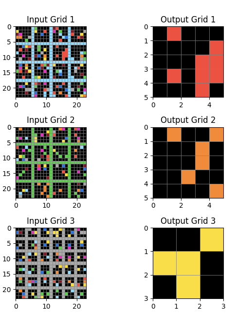

# BigARC: The Largest and Most Colorful Puzzles

**BigARC** is a new variant of the ARC challenge that focuses on the largest puzzles with the greatest number of colors. This challenge aims to push the boundaries of current ARC-solving techniques by introducing more complex and colorful grids.

## BigARC Tasks

BigARC tasks consist of grids with a large number of cells and a wide variety of colors. The goal is to identify and apply transformations that can handle the increased complexity and color diversity.

## Solution Approach

The solution approach for BigARC is still under development. It will likely involve advanced techniques for handling large grids and multiple colors, building on the methods used in other ARC challenges.

### Example

This is an example of a BigARC task, with a 23x23 grid and 10 colors:

The solution is: the subgrid with only 1 color.
We will now unpack that into composable reasoning steps.

### Subgrid Extraction

Each input has NxN subgrids identified by a regular lattice structure.
This is considered a job for the visual cortex component, so abstractly, this is a given primitive `split: Grid -> List[Grid]`.
There will be analogous primitives for other puzzle kinds, e.g. extracting all the objects, or all the colored objects etc.

### List Transformations

Subgrid extraction changes the type of the problem. The original problem operates on grids.
The next level problem operates on lists of grids: on transformations from `List[Grid]` to `Grid`.
This will not be the only kind of transformation from lists of grids. E.g. map-like transformations will be from lists to lists.
And it will not be the only transformation pattern of that type, e.g. subsequently painting one grid onto the next will be another transformation pattern from `List[Grid]` to `Grid`.

### Split List Transformation

The specific list transformation required for the example is the list split tranformation, which is parameterized by a given `split: Grid -> List[Grid]`, and applied to lattice split.

This is the rule:

The rules packages up the list of subgrids and delegates the problem to rules that operate on lists.

In the specific examle, each list happens to have NxN subgrids but in general, the only important thing is that each subgrid has a unique index.

### Select transformation

Given a list of grids, the select transformaiton chooses one.
In the example, the chose one is the one with only one color.

One way to look at that is that grids are embedded into a 1-dimensional space, with is a single boolean, indicating whether a single color is present.

In general, we will consider a space `Sp` and an embedding `emb: Grid -> Sp`. The role of the embedding is to identify the indended subgrid. So the problem is one of classification, and the classes considered are the elements of the space.

In general, given a list of grids, several features, such as number of colors and others, will be considered, and a number of them will be selected based on their ability to classify the correct subgrid.

This is the Select rule:

The rule operates on lists of grids, denoted `L` and `Li`, and produces a single grid.
It compares embeddings with a specific state `s`, which is used to select the correct subgrid.
In the examples, and in the test, `s` determines which subgrid to project to get the answer.
The inferred spec describes how `s` classifies the outputs in the examples.
The final output is computed by using the same `s` to classify the grids in the test input `L`.

### Solving the Example

To solve the example:
- level 1: apply the Split rule and move to the lists-to-grid space
- level 2: apply the Select rule using the `single color` predicate to generate the embedding.

## BigARC Evaluation

TODO
