# BigARC: The Largest and Most Colorful Puzzles

**BigARC** is a new variant of the ARC challenge that focuses on the largest puzzles with the greatest number of colors. This challenge aims to push the boundaries of current ARC-solving techniques by introducing more complex and colorful grids.

## BigARC Tasks

BigARC tasks consist of grids with a large number of cells and a wide variety of colors. The goal is to identify and apply transformations that handle the increased complexity and color diversity.

## Solution Approach

The solution approach for BigARC is still under development. It will likely involve advanced techniques for managing large grids and multiple colors, building on methods used in other ARC challenges.

### Example 1

Here’s an example of a BigARC task with a 23x23 grid and 10 colors:
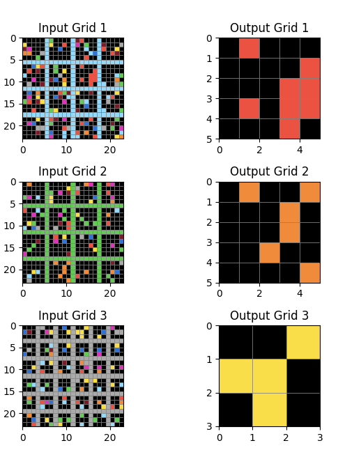

The solution is to identify the subgrid with only one color. We will now break this down into composable reasoning steps.

### Subgrid Extraction

Each input consists of NxN subgrids identified by a regular lattice structure. This process is handled by the visual cortex component and represented abstractly by a primitive `split: Grid -> List[Grid]`. Analogous primitives exist for other puzzle types, such as extracting all objects or all colored objects.

### List Transformations

Subgrid extraction changes the problem type: the original operates on grids, but now we must work with lists of grids. Transformations then apply from `List[Grid]` to `Grid`. Other transformation types also exist, like mapping lists to lists, or painting one grid onto another.

### Split List Transformation

In the example, we use a specific transformation called a "split transformation," parameterized by `split: Grid -> List[Grid]`, applied to the lattice split.

Here is the rule:

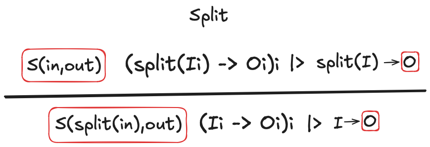

This rule packages the list of subgrids and delegates the task to rules that operate on lists.

In the specific example, each list contains NxN subgrids, though in general, the important point is that each subgrid has a unique index.

### Select Transformation

Given a list of grids, the **Select transformation** chooses one. In this example, it selects the grid with only one color.

Conceptually, grids are embedded into a 1-dimensional space with a single boolean, indicating whether a single color is present. Generally, we consider a space `Sp` and an embedding `emb: Grid -> Sp`. The role of the embedding is to identify the intended subgrid. Thus, the problem is one of classification, with the classes being elements of the space.

Several features, such as the number of colors, can be used to classify the correct subgrid. Here’s the Select rule:

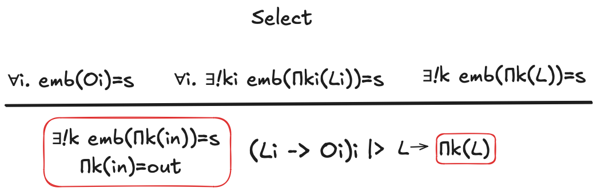

This rule operates on lists of grids, denoted `L` and `Li`, and produces a single grid. It compares embeddings with a specific state `s`, used to select the correct subgrid. In the example, `s` determines which subgrid to project to get the answer. The inferred specification describes how `s` classifies the outputs in the example. The final output is computed by using `s` to classify the grids in the test input `L`.

### Solving the Example

To solve the example:

- **Level 1**: Apply the Split rule and move to the lists-to-grid space.
- **Level 2**: Apply the Select rule using the `single color` predicate to generate the embedding.

### Example 2

Here’s another example of a BigARC task with a 23x23 grid and 10 colors:
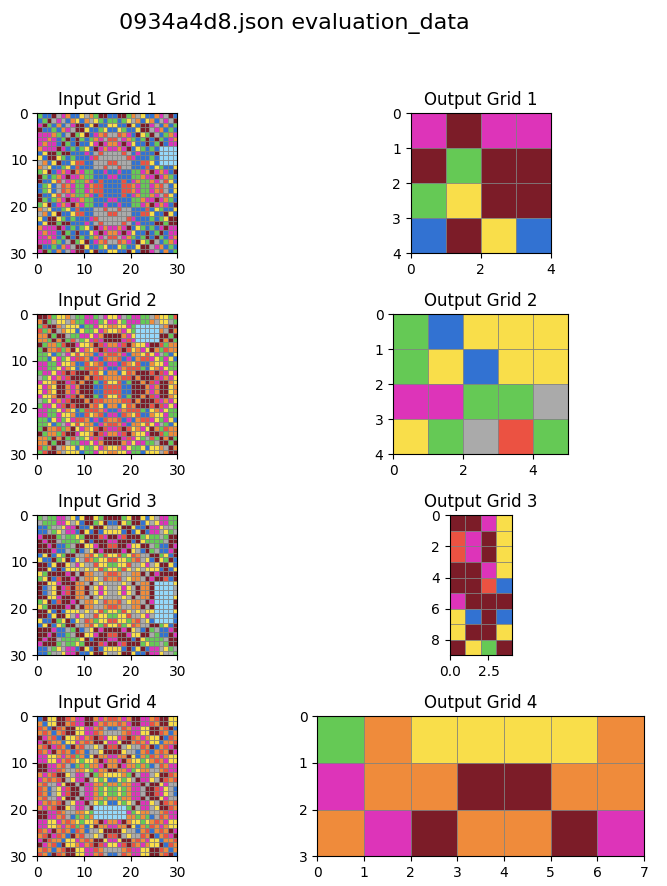

This example combines aspects from two subproblems:
1. The pattern from [InPaintingARC](InPaintingARC.md)
2. The size of the output from [SizeARC](SizeARC.md)

The pattern relies on Symmetry Masks, which means symmetries are satisfied only by a subset of the input (the mask). The solution from InPaintingARC is not sufficient as it relies on at least one symmetry to hold without a mask (e.g., to find the center of symmetry). Here, some extension is required to simultaneously determine both the symmetry masks and the center of symmetry.

---

### Three Approaches for Pattern Management

The introduction of Symmetry masks has expanded the range of expressible patterns, necessitating a more nuanced approach to pattern recognition and application. We can distinguish three main strategies:

1. **Shared Pattern**: 
   - Concept: The correct pattern emerges from analyzing all examples collectively.
   - Process: Combine insights from each example to form a unified solution.
   - Application: Apply this shared pattern to the test input.
   - Example: In puzzles like Sudoku, examining all examples together is crucial to identify the correct pattern.

2. **Pattern Relearn**: 
   - Concept: Individual patterns are correct for their respective examples, but no shared pattern exists.
   - Implication: Patterns vary across examples.
   - Approach: For each new input, including the test input, infer the pattern from scratch.
   - Strategy: Emphasizes adaptability and context-specific pattern recognition.

3. **Rule Abandonment**: 
   - Concept: Neither individual patterns nor their combination yields a correct solution.
   - Occurrence: Considered rare.
   - Action: Discard the current rule entirely and seek alternative approaches.

While these strategies are distinct, they can be viewed as part of a continuous spectrum rather than mutually exclusive categories. In a more nuanced approach, we can assign likelihood scores to each strategy:

- Rule Abandonment: Low likelihood of rule applicability.
- Shared Pattern: High likelihood of rule applicability, influenced by the likelihood of individual patterns.
- Pattern Relearn: Each pattern has a certain likelihood of applying, with the final solution being a combination of these likelihoods.

In this continuous model, multiple strategies can coexist with varying degrees of relevance.

To transition from the continuous model back to the discrete approach:

1. Consider only a limited set of predicates, each with a binary likelihood (0 or 1).
2. Prioritize strategies in this order:
   a. Shared Pattern (if predicates are found)
   b. Pattern Relearn (if Shared Pattern fails)
   c. Rule Abandonment (as a last resort when suitable predicates are not identified)


## Example 3

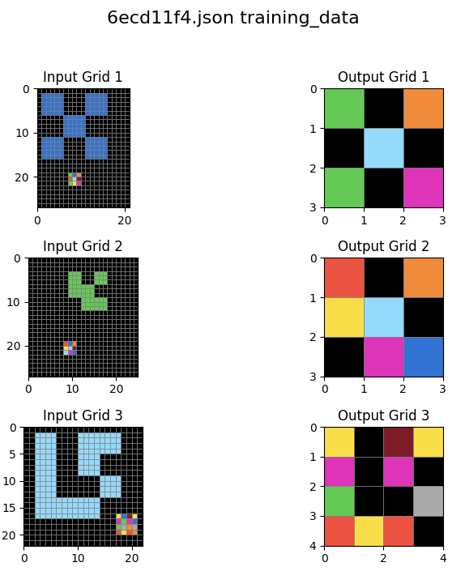

This example is an excellent test of compositional reasoning steps across multiple levels. Handling this example requires:

1. Creating a new meta-rule for combining two objects into one.
2. Generalizing the object extraction rule of the vision module to allow bounding box overlap (third example).
3. Using selection as above to pick the smaller object. This size-based selection was already used in [SizeARC](SizeARC.md).
4. Introducing a downscale rule (inverse of the upscale rule from another task) to reduce the "other" object's size. This requires a predicate similar to the n-periodic symmetry from [InPaintingARC](InPaintingARC.md), where `n` to be determined is the multiple of the smaller object's size.
5. Introducing a binary operation between grids of the same size to merge them into one. This specific instance requires right masking, but the general case requires learning a binary operation. Since the size of the output varies, this binary operation needs to be shared across all examples (it's a map operation). If it were the same, then a different rule could be used to express more nuanced patterns.

### Nested Testing and Transformation Specification

Example 3 demonstrates a complex, multi-level approach to solving the puzzle. The solver's output reveals a nested matching structure that mirrors the specification of the transformation. This hierarchical approach can be broken down as follows:

1. Level 1 (Outermost): Process multiple objects from the input, relating them to the output.
2. Level 2: Apply a downscaling operation to reduce the size of objects.
3. Level 3: Perform a binary operation to combine grids.
4. Level 4 (Implicit): Choose the specific masking operation.

The final transformation specification combines these elements in a nested structure:

- Outermost operation: Process multiple objects from the input.
  - Nested operation: Apply a downscaling operation, reducing object sizes by a factor of 4.
    - Further nested: Apply a binary operation to combine grids.
      - Deepest level: Use right-side masking (chosen at the implicit fourth level).
- Final step: Select objects based on the smallest area criterion.

This nested structure in both the testing and transformation specification highlights the complexity of the puzzle and the sophisticated reasoning required to solve it.


## Example 4

This is another test of compositional reasoning. There are several ways to approach this puzzle. The one we're going for has the property of reducing it to much simpler problems at the next level.

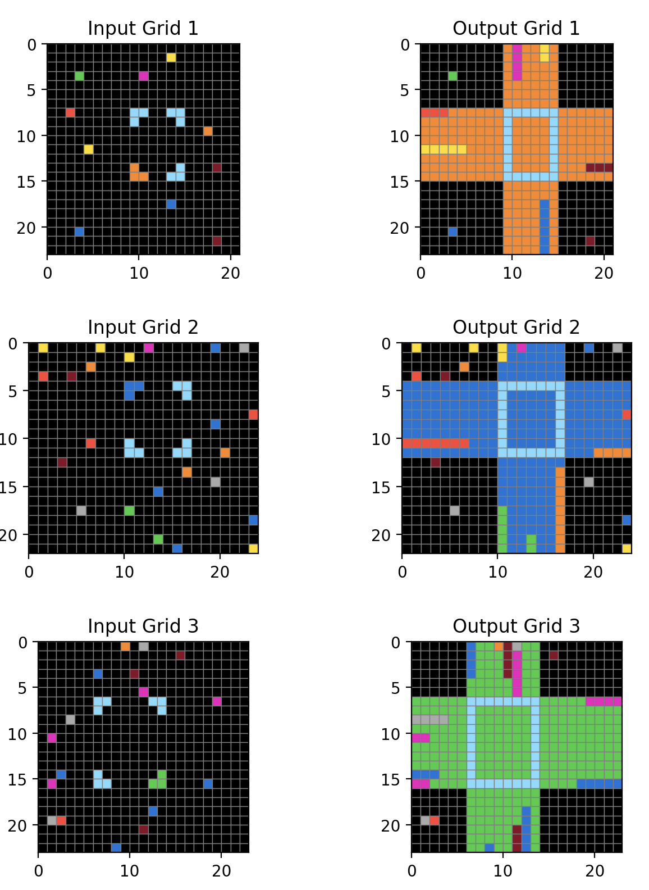


The rule is an instance of the parallel map rule. A simple example is:

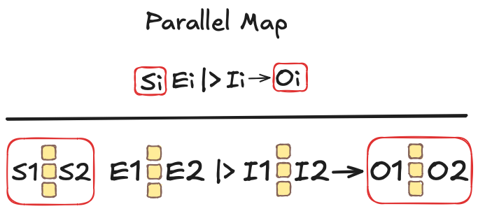

This rule encodes several puzzles into one.
In the full example, the frame can be used to split the grid into 9 subgrids. Each example has thus 9 subgrids, and since the number is always the same, one can solve 9 puzzles in parallel recursively.


## Example 5

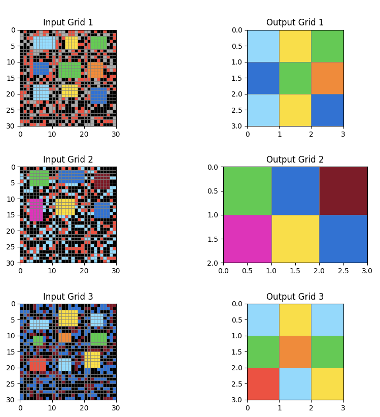

This example demonstrates a unique visual pattern: the input contains an NxM grid of objects, where (N,M) also defines the size of the output. This puzzle wasn't solved in [SizeARC](SizeARC.md) due to the complexity of size prediction being comparable to solving the ful problem in the first place.

The problem can be broken down into two main steps:

1. **Pattern Detection**: Identify the NxM grid of objects in the input.
2. **Color Mapping**: Transform the problem into a `List[Object] -> List[Color]` problem.

Once these steps are completed, the solution can be achieved by applying a map rule, which amounts to learning a function `Object -> Color`. In this specific case, the function merely extracts the "color" feature of each object.

## Example 6

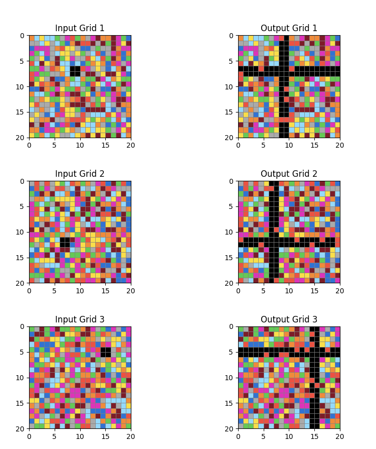

This example does not require compositional reasoning.

## Example 7

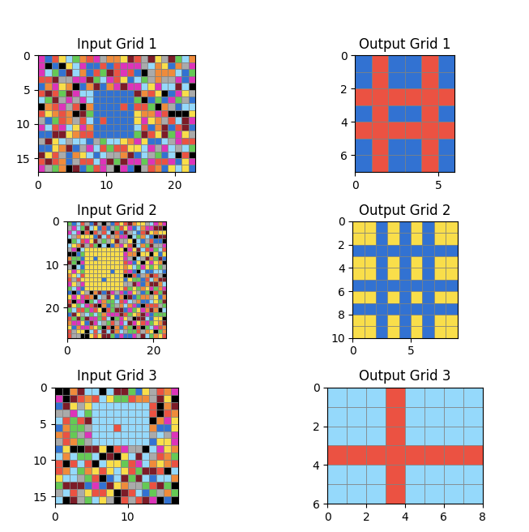

The toplevel tule recognizes that the size of the output is given by the largest frame (as done in [SizeARC](SizeARC.md) already), so the problem is reduced to one of type `Object -> Object`.

## Example 8

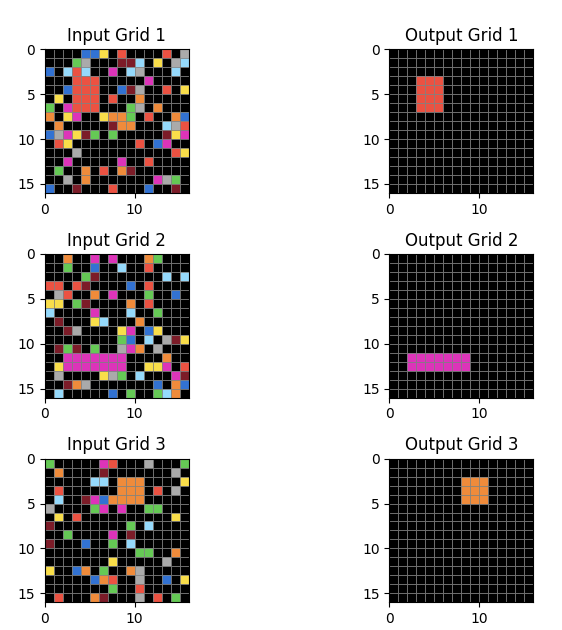

Simimal to example 7.


# Evaluation

These are the current results, indicating what's been implemented so far.
There are no coverage limitations, it's more a question of covering the example in a non ad-hoc way.

```
Training data: Correct: 4, Incorrect: 2, Score: 66.6%
Evaluation data: Correct: 8, Incorrect: 3, Score: 72.7%
```


# Summary and Lessons Learned

## What We Set Out to Do

The BigARC challenge was conceived to push the boundaries of ARC-solving techniques by introducing larger and more colorful puzzles. Our primary goals were:

1. To test the scalability of existing ARC solutions on larger grids.
2. To explore how increased color diversity affects pattern recognition and solution strategies.
3. To develop new compositional reasoning techniques for handling complex, multi-step puzzles.
4. To create a framework for solving puzzles that require nested, hierarchical approaches.

## What We Learned

Through the development and analysis of BigARC, we gained several valuable insights:

1. **Compositional Reasoning is Crucial**: Many BigARC puzzles require multi-step, nested solutions. This reinforced the importance of developing modular, composable solving techniques that can be combined in various ways.

2. **Abstraction Levels Matter**: We found that breaking down problems into different levels of abstraction (e.g., grid-level, object-level, color-level) allows for more flexible and powerful solving strategies.

3. **Generalization of Existing Techniques**: Many techniques developed for standard ARC puzzles (like those from InPaintingARC and SizeARC) could be adapted and extended for BigARC, showing the value of building upon existing knowledge.

4. **The Importance of Meta-Rules**: Creating meta-rules for combining objects or applying transformations across multiple examples proved to be a powerful approach for handling complex puzzles.

5. **Visual Processing Challenges**: Larger grids and more colors highlighted the need for more sophisticated visual processing techniques, particularly in areas like object extraction and symmetry detection.

6. **Adaptability is Key**: The variety of puzzle types in BigARC emphasized the need for solving strategies that can adapt to different problem structures, rather than relying on fixed algorithms.
