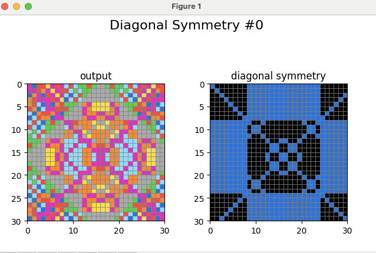

# InPaintingARC: A Vertical Subset of ARC-AGI

**InPaintingARC** is a specialized variant of the [ARC (Abstraction and Reasoning Corpus) challenge](https://github.com/fchollet/ARC). It focuses on a narrower variety of puzzles while maintaining the complexity of individual tasks found in the broader ARC-AGI domain. InPaintingARC emphasizes deep understanding of spatial patterns, transformations, and frame invariants, making it an ideal platform for exploring advanced reasoning techniques such as [bi-abductive inference](https://fbinfer.com/docs/separation-logic-and-bi-abduction/) and the application of the [frame rule](https://en.wikipedia.org/wiki/Separation_logic).

---

## InPainting Tasks

An inpainting task consists of grids where the input is the same as the output except for a number of cells covered with a specific color. The outputs contain recognizable patterns, allowing the reconstruction of the original grid from just the input.

Here's an example:

The ARC-AGI dataset contains 21 inpainting tasks, 8 of which are for training and 13 for evaluation.

## Solution Approach

The solution to InPaintingARC leverages **bi-abductive inference** to derive transformation specifications from given examples. This involves formulating **spatial specifications** that are composable and capturing key puzzle elements through formal **predicates**. The approach focuses on both inferring the transformations (`Spec`) and identifying the invariant parts of the grid (`Frame` or `R`) that remain unaffected.

### Bi-Abductive Inference

**Bi-abduction** is a reasoning process that simultaneously infers both the missing specifications and the frame conditions required to explain observed behavior. In the context of grid transformations, bi-abduction aims to derive:

- **Specification (`Spec`)**: The minimal set of rules that explain the transformations in the examples.

#### General Shape of Bi-Abduction

The general form of bi-abduction can be expressed as:

$$
[\text{Spec}] \quad \text{Examples} \quad \vdash \quad \text{Input} \rightarrow [\text{Output}]
$$

- `[Spec]`: The specification inferred from the examples.
- `Examples`: Given input-output pairs demonstrating the transformation.
- `Input`: Given grid to which the specification will be applied.
- `[Output]`: The inferred resulting grid after applying the specification to the input.

### Notation

#### Grid and Cells

- **Grid (`G`)**: A finite set of colored cells.
- **Position (`X`)**: Identified by its coordinates \( X = (x, y) \).

#### Color Predicate

- `G[X] = C`: Predicate indicating that cell `X` in grid `G` has color `C`.

#### Pattern Predicate

- `Pattern(X)`: A predicate defining a pattern for cell `X`. For example, in a checkerboard pattern:

$$
\text{Pattern}(x,y) \iff G[x,y] =
\begin{array}{ll}
black  & \text{if} \quad (x + y) \bmod 2 = 0 \\
red  & \text{otherwise}
\end{array}
$$

### Example

From the examples one can infer

$$
Spec \iff \text{in}.\text{rot90()} = \text{out}
$$

So the final derivation is

-----

## InPaintingARC Evaluation

This section presents the predicates used to describe patterns used to solve inpainting tasks, and which tasks they can solve.

### Predicates

#### Periodic Symmetry

There are 4 kinds of periodic symmetries:
- Horizontal: `px=3` means that the pattern repeats every 3 cells horizontally.
- Vertical: `py=3` means that the pattern repeats every 3 cells vertically.
- Diagonal: `pd=3` means that the pattern repeats every 3 cells diagonally.
- Anti-diagonal: `pa=3` means that the pattern repeats every 3 cells anti-diagonally.

#### NonPeriodic Symmetry with Offset

There are 4 kinds of nonperiodic symmetries with offset:
- Horizontal: `hx` means that the grid is reflected horizontally.
- Vertical: `vy` means that the grid is reflected vertically.
- Diagonal: `rd` means that the grid is reflected diagonally.
- Anti-diagonal: `ra` means that the grid is reflected anti-diagonally.
- Offset: `(3,2)` means that the centre of rotations is shifted 3 cells horizontally and 2 cells vertically.

#### Row and Column Color Cardinality

There are 2 kinds of row and column color cardinality:

- **Row Cardinality (`CardinalityInRowPredicate(color, count)`)**: This predicate checks if each row in the grid contains exactly `count` occurrences of the specified `color`. For example, `CardinalityInRowPredicate(RED, 3)` means that each row in the grid must have exactly 3 cells colored red.

- **Column Cardinality (`CardinalityInColumnPredicate(color, count)`)**: This predicate checks if each column in the grid contains exactly `count` occurrences of the specified `color`. For example, `CardinalityInColumnPredicate(BLUE, 2)` means that each column in the grid must have exactly 2 cells colored blue.

The cardinality predicates, when set to 1 for all colors, encode the rules of sudoku. And there is one such puzzle in the set.
However, one can also choose different values, for example 2 horizontally gives "double sudoku":

### Puzzles solved by predicate classes

Out of 8 training and 13 evaluation puzzles, the following distribution of predicates is observed:

- Periodic Symmetry: 5 training, 4 evaluation
- Non-Periodic Symmetry: 2 training, 5 evaluation
- Cardinality: 0 training, 1 evaluation
- All Three: 7 training, 10 evaluation

-----

## Advanced Cases

We consider two advanced cases where the input is more complex and requires more advanced reasoning techniques. The goal of these techniques is to reduce the reasoning complexity by breaking down the problem into smaller subproblems, which can then be solved using the predicates described above.

We present a single reasoning extension: the **frame rule** to handle both cases.

### Pattern In Context

In this puzzle, the pattern is not isolated but part of a larger grid.

### Multiple Patterns

In this puzzle, the pattern is complicated and appears to follow some snake-like lines. However, if one splits along the diagonal, then two regular patterns emerge.

### The Frame Rule

The **frame rule** allows us to extend the specification to include parts of the grid that remain unaffected by the transformation. It was first formulated for Separation Logic in the context of program verification and shape analysis.

It is formulated as:

$$
\frac{[\text{Spec}] \quad \text{Examples} \quad \vdash \quad \text{Input} \rightarrow [\text{Output}]}{[\text{Spec} * R] \quad \text{Examples} * R \quad \vdash \quad \text{Input} * R \rightarrow [\text{Output} * R]}
$$

- `Spec * R`: The combined specification, where `Spec` and `R` are combined using the separating conjunction `*`, indicating they operate on disjoint parts of the grid.
- `Examples * R`, `Input * R`, `Output * R`: The extension of examples, input, and output by including the frame `R`.

The **separating conjunction** `*` asserts that the domains of `Spec` and `R` are disjoint, ensuring that the transformation and the frame do not interfere with each other.

### Application of the Frame Rule

For the first puzzle, the frame rule can be applied by literally using the frame as a frame.

For the second puzzle, the frame rule can be applied by splitting the problem along the diagonal.

### Puzzles solved by the frame rule

- All predicates and Frame Rule: 7 out of 8 training, 12 out of 13 evaluation.

## Symmetry Masks

The remaining unsolved evaluation puzzle has orizontal, vertical and anti-diagonal symmetries.
However, that is not sufficient to solve the puzzle.
The solution relies on having diagonal symmetry on certain parts of the grid.
To addess this, we refine the non-periodic symmetry predicate to also allow a mask to specify which parts of the grid are affected by the symmetry:

In the picture above, the black cells in the mask indicate where the diagonal symmetry does not hold.

### Puzzles solved with symmetry masks

- All predicates and Frame Rule and Symmetry Masks: 7 out of 8 training, 13 out of 13 evaluation.
