# Generalization as Inductive Structure

## From ARC to a structural account of epiplexity

### Abstract

What is the mathematical object discovered when a learner generalizes? Instead of starting from a scalar complexity, this note treats generalization as **structure**: a partial order of explanations generated by operations such as substitution, anti-unification, parameter freeing, and constraint weakening. Evidence filters explanations, but need not totally order them. A fixed inductive representation determines what follows from what; learning changes that representation.

The central distinction is:

> **Generalization is about the semantic endpoint: what consequences are justified by the learned representation.**  
> **Learning difficulty is about the path: how much evidence and computation it takes to discover that representation.**

A real ARC task, `7e0986d6`, gives a compact worked example. Two qualitatively different explanations survive all official training and test data. A generated six-cell witness distinguishes them. An incremental learner reaches the same final representation under all six orders of three demonstrations, while discovering the crucial abstraction at different points in the sequence. This suggests a possible role for epiplexity-like quantities: not as the definition of structure, but as measurements of the difficulty of discovering an underlying inductive structure.

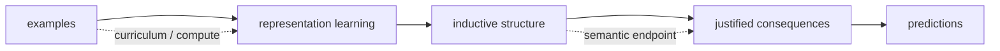

### Reading map

The argument has four steps:

1. **Do not force a total ranking.** Keep only pairwise generality relations that have a structural justification.
2. **Represent learning as discovering those relations.** Anti-unification and constraint weakening turn isolated cases into instances of a shared schema.
3. **Separate a fixed representation from learning it.** A representation has consequence semantics; learning changes the representation itself.
4. **Use ARC to expose the distinction.** A tiny example can reveal a missing abstraction that much larger examples leave unresolved, while the final abstraction can remain robust to curriculum order.

---

## 1. A partial order, not a score

Let `H` be a hypothesis space. Write

$$h \succeq g$$

when `h` is at least as general as `g`. We only introduce such an edge when there is a reason to do so. The relation need only be a preorder; after quotienting equivalent hypotheses it becomes a partial order.

Given evidence `E`, define the version space

$$V(E)=\{h\in H \mid h\text{ agrees with }E\}.$$

The preferred generalizations are the **undominated** elements of `V(E)`: the consistent hypotheses for which no strictly more general consistent hypothesis is known.

There need not be one.

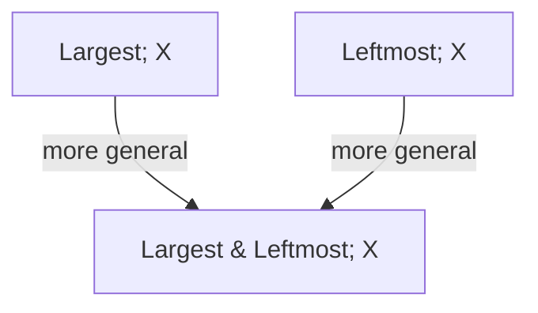

`Largest&Leftmost` is a specialization of each rule above it. But `Largest` and `Leftmost` remain incomparable. The theory removes a gratuitous restriction without inventing a winner.

This is the first important departure from shortest-program reasoning: **ambiguity is allowed to survive when the theory has not earned a comparison.**

---

## 2. Where the order comes from

### 2.1 Weakening assumptions

Write an explanation as `(t, Phi)`, where `t` is a parametric term and `Phi` constrains its parameters or applicability. For the same term,

$$(t,\Phi_1) \succeq (t,\Phi_2)$$

when

$$\Phi_2 \Rightarrow \Phi_1.$$

So generality is **constraint weakening**. No assumptions are counted; logical implication supplies the order.

```text
Largest & Leftmost               -> Largest
FlipX(size in {2,3,4})           -> FlipX(any size)
component repair + frequency     -> component repair
```

### 2.2 Anti-unification constructs new structure

Constraint weakening assumes that the parametric term already exists. Learning can construct it.

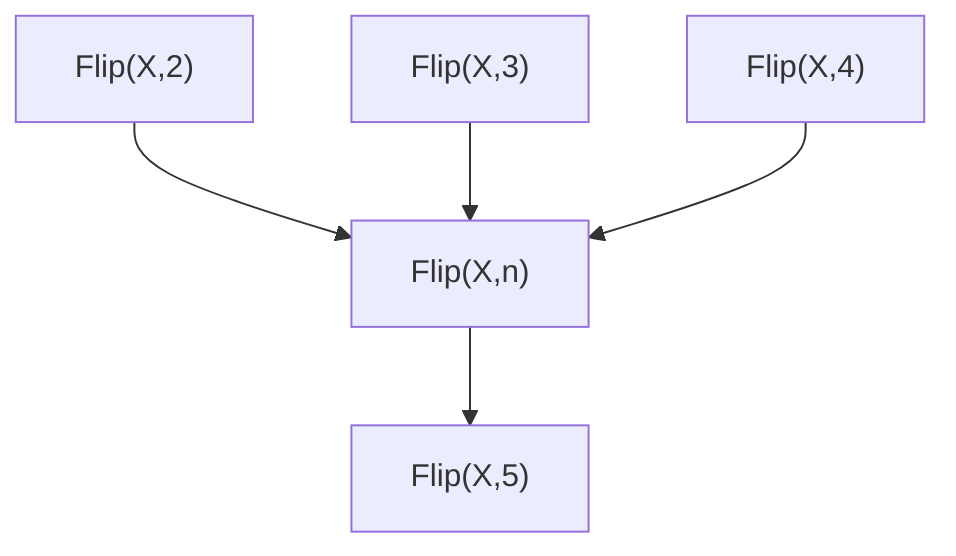

Anti-unification discovers a shared schema `T` such that

$$t_i=T\sigma_i.$$

Before discovering `T`, the observations may be unrelated ground facts. Afterwards they are recognized as instances of one structure.

A counterexample can show that a variable was too permissive:

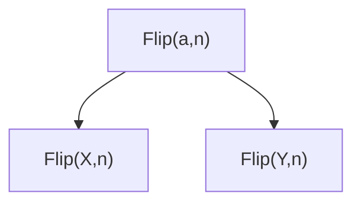

The useful size parameter survives while the action parameter is split. Representation learning therefore has two complementary moves:

> **merge distinctions that do not matter; split distinctions that do matter.**

Neither direction is globally preferable.

---

## 3. Parameters need domains

Anti-unification alone does not justify arbitrary substitution. From `Flip(X,2)`, `Flip(X,3)`, and `Flip(X,4)` we can discover a size variable, but predicting size 5 still requires a domain or relation for that variable.

Three sources should be kept distinct:

| source | example | status |
|---|---|---|
| background typing | `n : ObjectSize` | supplied by the representation |
| primitive semantics | `FlipX` preserves dimensions | follows from the primitive |
| empirical relation | `b=a+1` from `(2,3),(3,4),(4,5)` | genuinely induced and refutable |

A learned schema is therefore naturally `(t, Phi)`, where `Phi` describes admissible substitutions.

Different representations expose different constraint languages. A ground domain may express only the observed pairs; an interval domain may overgeneralize; a relational domain may express `b-a=1` exactly. This is one point of contact with abstract interpretation.

---

## 4. A fixed representation has consequence semantics

A fixed representation `R` determines which unseen cases are licensed by which observations. Extensionally this can often be represented by a closure operator `cl_R`.

The intuition is more important than the notation:

> `cl_R(E)` is **everything the current representation says follows from the examples `E`**.

The central correction is:

> **Closure is not learning. Closure is the consequence semantics of a fixed inductive state. Learning changes the state.**

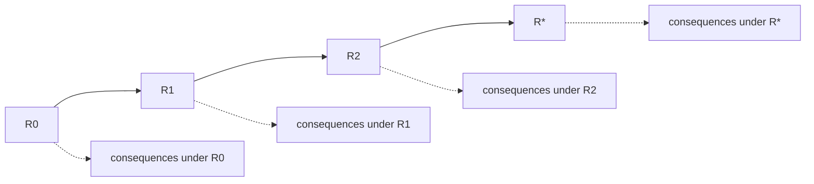

For a synthetic task with intended concept `T`:

$$cl_R(E)\subseteq T$$

is **inductive soundness**,

$$T\subseteq cl_R(E)$$

is **inductive completeness**, and exact generalization is

$$cl_R(E)=T.$$

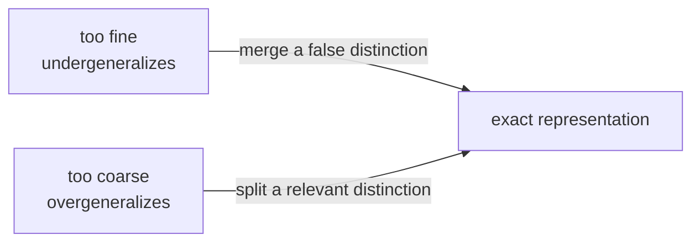

So “more general” does not mean “better”. A useful representation can be reached by merging distinctions or by introducing them.

### Why abstraction changes generalization

The same ground behavior can have different generality structure in different representations.

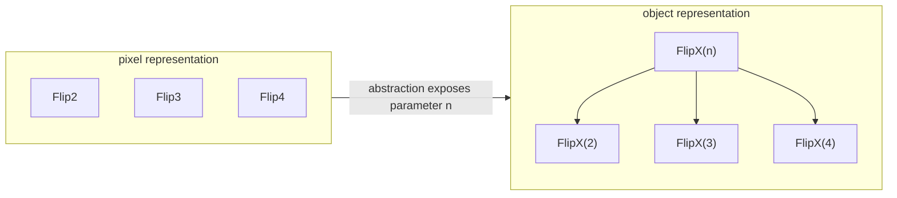

At pixel level the operations may be unrelated atoms. At object level they become substitution instances of one term.

> **An abstraction can help generalization by exposing relations between explanations that were absent in the lower-level representation.**

This is logically distinct from making search cheaper.

---

## 5. Real ARC experiment: `7e0986d6`

This task contains large regions of one foreground color disturbed by small components of another. The output removes nuisance components, restoring nuisance cells to a nearby large component when appropriate and otherwise returning them to background. The two official training examples use different colors, and the test changes them again.

Below is a literal crop from the ARC interface screenshot, not a reconstruction. It is deliberately shown at roughly the scale a human solver sees it: a visually rich example with many cells and several apparent regularities.

<p align="center">
  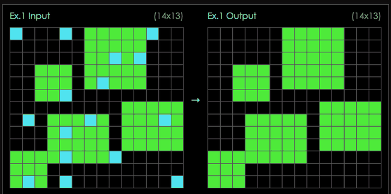
</p>

We compared four executable explanations:

| explanation | train | test | status after official data |
|---|:---:|:---:|---|
| connected-component repair | yes | yes | undominated |
| frequency shortcut | yes | yes | dominated |
| fixed first color pair | no | no | refuted |
| per-cell local shortcut | yes | yes | incomparable |

The structural order contributes information that interpolation does not:

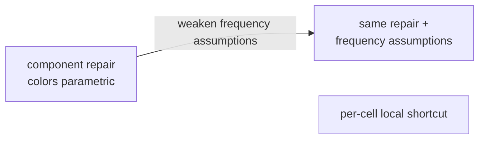

The frequency shortcut is the same component schema plus extra assumptions, so it is dominated. The fixed-color rule is refuted by the second demonstration: color identity must become a parameter.

But the per-cell rule is a genuinely different schema. **It survives every official training and test pair.** The evidence does not eliminate it and the current order does not compare it with the component rule.

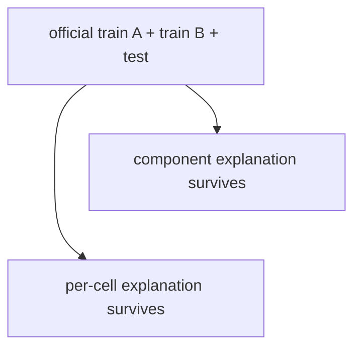

This is already a useful ARC phenomenon: interpolation plus the official held-out test does not uniquely determine the explanatory schema.

---

## 6. Six cells reveal what the full task does not

We then searched automatically for a small input on which the two surviving explanations disagree. The minimal meaningful witness found by the search is:


The two nuisance cells form **one connected component**. Collectively the component is sufficiently adjacent to the reference component, so the structural rule repairs both. The per-cell shortcut judges them independently and erases the rightmost cell.

Adding the structural output as a demonstration preserves the component explanation and refutes the local shortcut.

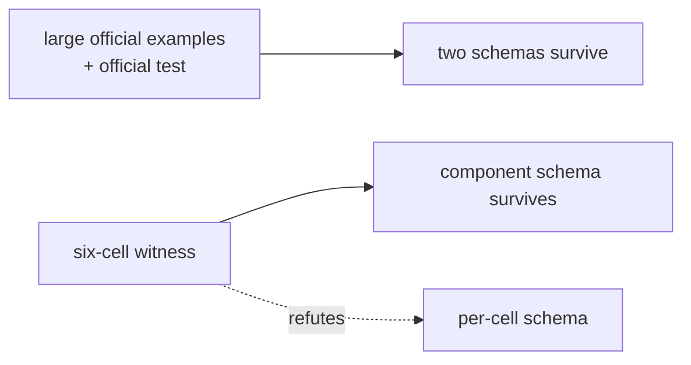

> **Six foreground cells expose a structural distinction that the much larger official examples do not expose.**

This is the main intuition to carry forward: **the value of an example depends on which ambiguity it resolves, not on its raw size.**

A precision point matters here. The per-cell explanation is not “less general” than the component explanation in our current partial order; the two were incomparable. The witness eliminates one by evidence. At the representation level, however, the correction can be described as discovering that nuisance cells must preserve **connected-component identity** rather than transform independently.

---

## 7. Confluence versus curriculum

Call the two official demonstrations `A` and `B`, and the tiny witness `W`. We implemented a deliberately small incremental learner that can revise three commitments:

- fixed colors versus parametric color roles;
- per-cell versus connected-component structure;
- an extra frequency-role assumption.

It does **not** recompute the batch version space after each observation. It repairs its current representation only when an example forces a change.

All six permutations of `A`, `B`, and `W` reached exactly the same final state:

```text
parametric colors
connected nuisance components
no frequency-role assumption
```

For this learner and this example set, the endpoint is therefore both strongly and semantically confluent. The paths are not the same.

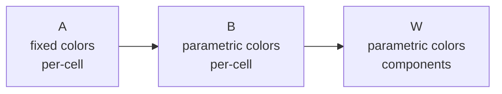

versus

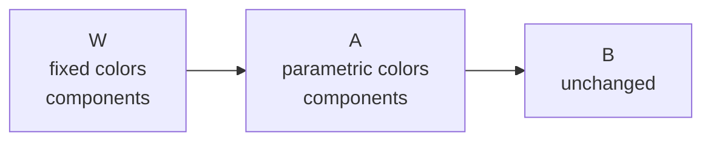

The decisive component abstraction is discovered at step 3 in the first curriculum and step 1 in the second.

> **The endpoint can be robust while the discovery path is curriculum-dependent.**

This is only a result about this finite incremental learner, not a general confluence theorem. It is useful because it separates two things that a training curve can easily mix together: the structure eventually learned and the cost or timing of discovering it.

---

## 8. Revelation is state-relative

An example does not have a fixed amount of structural information independently of the learner's current inductive state.

Let `I` be the current state and let `Rev_I(e)` denote the representation changes revealed or forced by example `e` from that state.

After observing `A`, the large official example `B` reveals approximately

```text
{ color parametricity }
```

while the tiny witness `W` reveals

```text
{ color parametricity,
  connected-component coupling,
  removal of the frequency assumption }
```

for this learner.

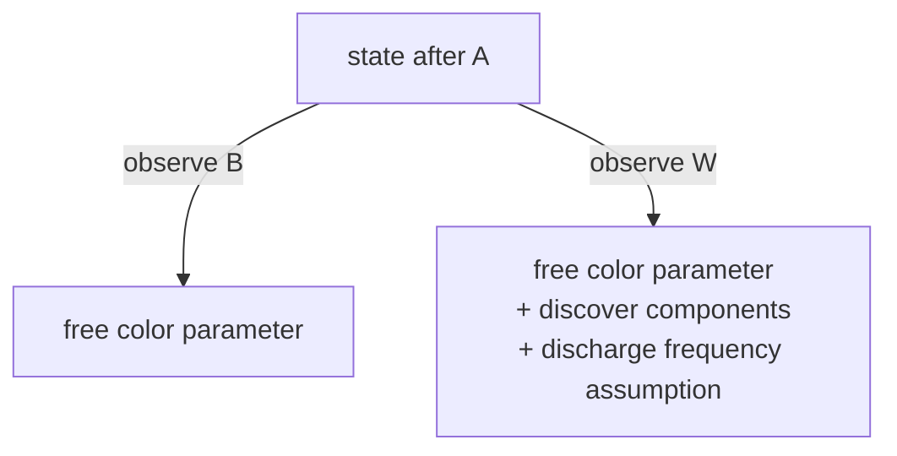

This suggests a state-relative order on examples:

$$e_1\preceq_I e_2$$

when

$$Rev_I(e_1)\subseteq Rev_I(e_2).$$

Two examples may instead reveal incomparable structure. So a learning event is naturally a transition

$$I\longrightarrow I'$$

in a structured space of inductive states, rather than an intrinsic scalar attached to the example.

---

## 9. Where the machinery comes from

The ingredients have classical antecedents; that is useful because we can reuse mature machinery rather than reinvent it.

| tradition | useful ingredient here |
|---|---|
| anti-unification (Plotkin, Reynolds) | construct a shared schema from ground instances |
| version spaces (Mitchell) | preserve ambiguity under a general-to-specific partial order |
| inductive logic programming | subsumption and semantic generality relative to structured background knowledge |
| programming by example | represent many programs consistent with sparse examples; exposes the intended-extrapolation problem |
| abstract interpretation | closure operators, abstract domains, and refinement as an order-theoretic language for representation |

The goal is not to claim novelty for the individual pieces. The question is whether they combine into a useful account of **generalization semantics plus learning dynamics**, especially for ARC.

---

## 10. Connection to epiplexity

The investigation began from discomfort with defining learnable structure by training a model. The experiments suggest a possible factorization:

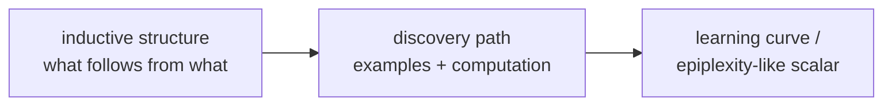

The candidate structural object is an **inductive representation**: a preorder or consequence structure saying which explanations are instances, specializations, or consequences of others. A closure operator can give its extensional semantics.

A learning experiment probes the computational process by which an observer constructs or refines that representation:

$$I_0\to I_1\to\cdots\to I_*.$$

The ARC experiment gives a microscopic example in which all curricula reach the same `I*`, but the important abstraction is discovered at very different points.

So a candidate interpretation is:

> **Generalization describes the structural endpoint. Epiplexity-like quantities may describe something about the difficulty or path of discovering that endpoint.**

This would explain why a learning experiment can be informative while still feeling unsatisfactory as the *definition* of structure. A learning curve can mix at least three things:

- the cost of constructing a useful representation;
- the evidence required to discriminate it from alternatives;
- the predictive consequences once it has been found.

The structural account tries to factor those apart before deciding whether any of them should be collapsed back to a scalar.

---

## 11. Open questions

The current account is intentionally incomplete. The most important questions are:

1. **Admissible representation operations.** Which anti-unifications, abstractions, parameter domains, and splits are available to the learner?
2. **Confluence.** Is the robust endpoint observed here typical, or do richer learners exhibit genuine path-dependent final generalizations?
3. **Real ARC coverage.** On a corpus of intended and spurious programs, how often does the intended explanation dominate by substitution or constraint weakening, and where does it remain incomparable?
4. **Representation equivalence.** When should syntactically different inductive states count as the same semantic structure?
5. **State-relative revelation.** Can useful example-selection or curriculum principles be defined directly from refinement relations rather than a scalar information score?
6. **Relation to epiplexity.** Can a training-based scalar be understood as measuring computational distance through a space of inductive structures rather than defining structure itself?

The immediate empirical program is to repeat the real-task analysis across a small ARC corpus, automatically generate discriminating examples for surviving incomparable explanations, and test whether the resulting refinements remain confluent under changes of curriculum.
