# Generalization as Inductive Structure

## From ARC to a structural account of epiplexity

### Abstract

What is the mathematical object discovered when a learner generalizes? Instead of starting with a scalar complexity, this note treats generalization as **structure**: a partial order of explanations generated by substitution, anti-unification, parameter freeing, and constraint weakening. Evidence filters explanations but need not totally order them. A fixed inductive representation induces consequences; learning changes that representation.

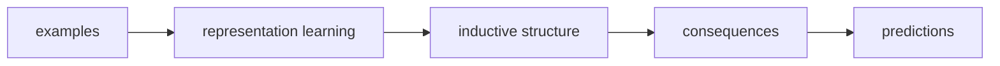

This separates two questions that are often mixed together:

> **What is the generalization?** — a semantic question about inductive structure.
>
> **How hard is it to discover?** — a computational question about the learning path.

A real ARC task, `7e0986d6`, gives a small worked example. Two explanations survive all official training and test data; a six-cell counterexample distinguishes them. An incremental learner reaches the same final representation under all six orders of three demonstrations, while discovering the crucial abstraction at different times.

---

## 1. A partial order, not a score

Let `H` be a hypothesis space. Write

$$h_1 \preceq h_2$$

when `h2` is at least as general as `h1`. Given evidence `E`,

$$V(E)=\{h\in H \mid h\text{ agrees with }E\}.$$

The candidate generalizations are the undominated consistent hypotheses:

$$G(E)=\mathrm{Max}_{\preceq}\,V(E).$$

There need not be one.

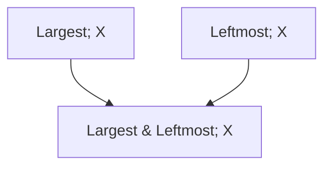

`Largest&Leftmost` is a specialization of each rule above it. But `Largest` and `Leftmost` remain incomparable. The theory removes a gratuitous restriction without inventing a winner.

---

## 2. Generality by weakening assumptions

Write an explanation as `(t, Phi)`, where `t` is a parametric term and `Phi` constrains its parameters or applicability. For the same term,

$$(t,\Phi_1) \succeq (t,\Phi_2)$$

when

$$\Phi_2 \Rightarrow \Phi_1.$$

Generality is **constraint weakening**. No assumptions are counted; implication supplies the order.

```text
Largest&Leftmost                 -> Largest
FlipX(size in {2,3,4})           -> FlipX(any size)
component-repair + frequency     -> component-repair
```

---

## 3. Anti-unification creates generality structure

Constraint weakening assumes the parametric term already exists. Learning can construct it.

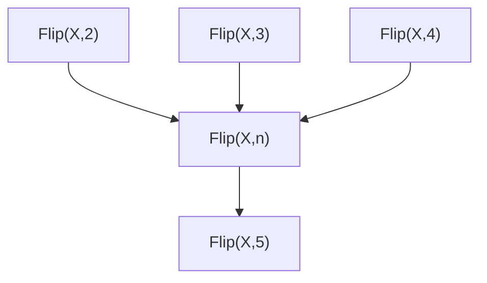

Anti-unification discovers a shared schema `T` such that

$$t_i=T\sigma_i.$$

Before discovering `T`, the observations can be unrelated ground facts. Afterwards they are recognized as instances of one structure.

A counterexample can show that a variable was too permissive:

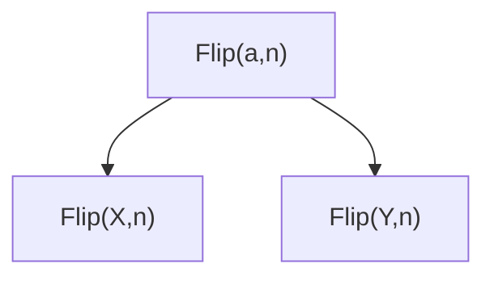

The useful size parameter survives while the action parameter is split. Representation learning therefore has two complementary moves:

**merge distinctions that do not matter; split distinctions that do matter.**

---

## 4. Variables need domains

Anti-unification alone does not justify arbitrary substitution. From `Flip(X,2)`, `Flip(X,3)`, and `Flip(X,4)` we can discover a size variable, but predicting size 5 requires a domain or relation for that variable.

Three sources should be distinguished:

1. **background typing** — `n : ObjectSize`;
2. **primitive semantics** — `FlipX` preserves dimensions;
3. **empirical relations** — for example `b=a+1` inferred from `(2,3), (3,4), (4,5)`.

Different representations expose different constraint languages. A ground domain may only express observed pairs; an interval domain may overgeneralize; a relational domain may express `b-a=1` exactly. This is one connection to abstract interpretation.

---

## 5. Closure is the semantics of a fixed representation

A fixed representation `R` determines which ground instances follow from which observations. Extensionally this can often be represented by a closure operator `cl_R`.

The important point is:

> **Closure is not learning. Closure is the consequence semantics of a fixed inductive state. Learning changes the state.**

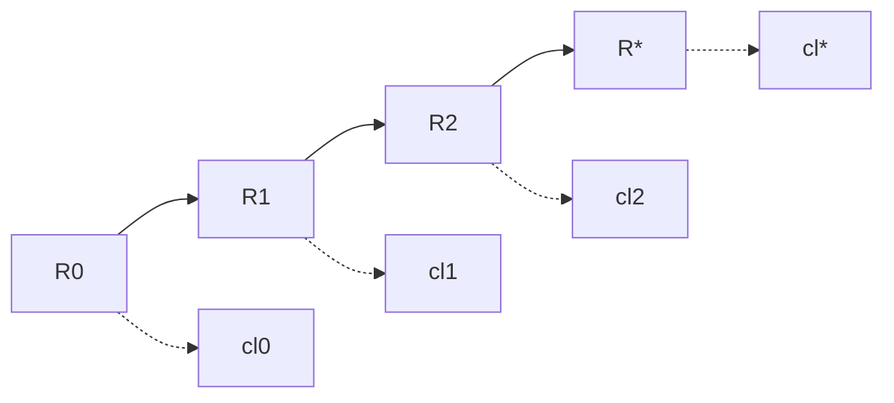

For a synthetic task with intended concept `T`:

$$cl_R(E)\subseteq T$$

is inductive soundness,

$$T\subseteq cl_R(E)$$

is inductive completeness, and exact generalization is

$$cl_R(E)=T.$$

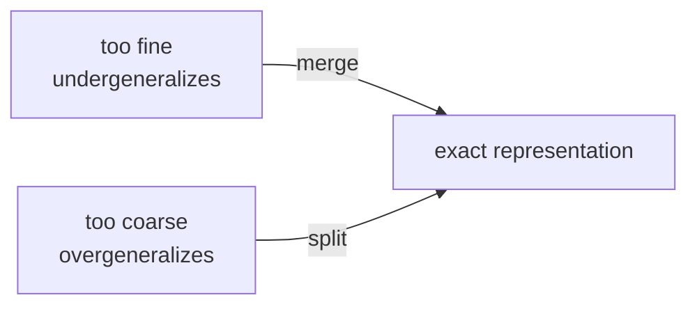

More generalization is therefore not automatically better.

---

## 6. Why abstraction changes generalization

The same behavior can have very different generality structure in different representations.

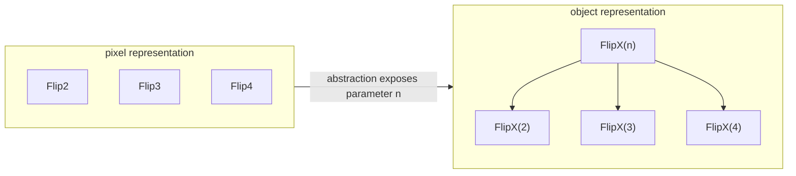

At pixel level the operations may be unrelated atoms. At object level they become substitution instances of one term.

> **An abstraction can help generalization by exposing relations between explanations that were absent in the lower-level representation.**

This is independent of whether the abstraction also makes search cheaper.

---

## 7. Real ARC experiment: `7e0986d6`

The task contains large regions of one foreground color disturbed by small components of another. The output removes nuisance components, restoring nuisance cells to a nearby large component when appropriate and otherwise returning them to background. The two training examples use different colors, and the test changes them again.

Here is the first official demonstration, **cropped directly from the ARC interface screenshot** rather than redrawn. This is useful context for the much smaller witness below.


We compared four executable explanations:

| explanation | train | test | result |
|---|:---:|:---:|---|
| connected-component repair | yes | yes | undominated |
| frequency shortcut | yes | yes | dominated |
| fixed first color pair | no | no | refuted |
| per-cell local shortcut | yes | yes | incomparable |

The justified structural edge is:

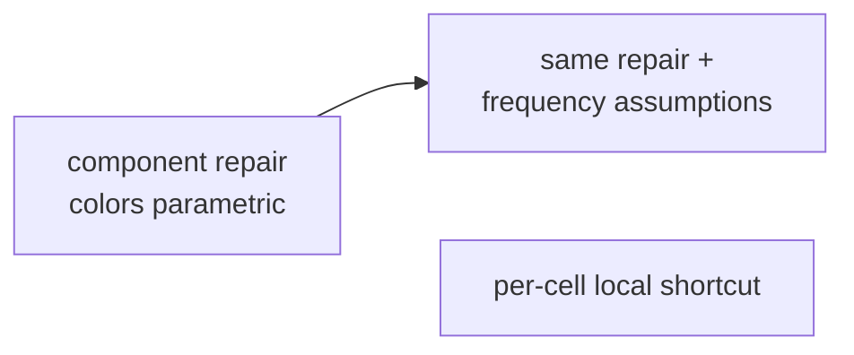

The frequency shortcut is the same component schema plus extra assumptions. The per-cell rule is genuinely different: **it survives every official training and test pair**, so evidence does not eliminate it and the current order does not compare it with the component rule.

This is already a useful ARC phenomenon: interpolation plus the official held-out test does not uniquely determine the explanatory schema.

---

## 8. Six cells reveal what the full task does not

An exhaustive small-grid search found this minimal meaningful witness. Blue is the reference component; orange is one nuisance component.

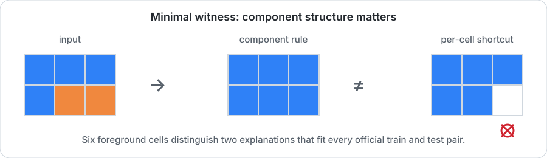

The two orange cells form one connected component. Collectively the component is sufficiently adjacent to the reference component, so the structural rule repairs both. The per-cell shortcut judges them independently and erases the rightmost cell.

Adding the structural output as a demonstration preserves the component explanation and refutes the local shortcut.

> **Six foreground cells expose a structural distinction that the two much larger ARC demonstrations and the official test do not expose.**

This is a useful intuition for the rest of the note: the value of an example depends on which ambiguity it resolves, not on its raw size.

---

## 9. Confluence and curriculum

Call the two official demonstrations `A` and `B`, and the tiny witness `W`. We implemented an incremental learner that can revise three commitments:

- fixed colors versus parametric color roles;
- per-cell versus connected-component structure;
- an extra frequency-role assumption.

All six permutations of `A`, `B`, and `W` reached exactly the same final representation:

```text
parametric colors
connected nuisance components
no frequency-role assumption
```

So this experiment is **strongly and semantically confluent**. But its paths differ.

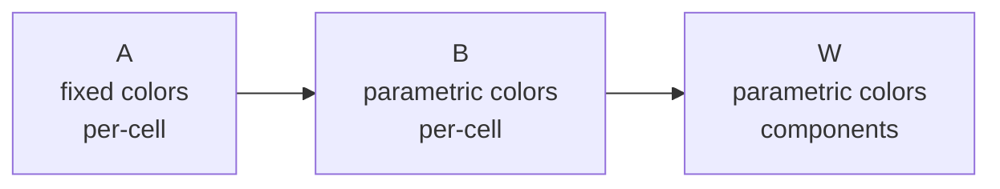

versus

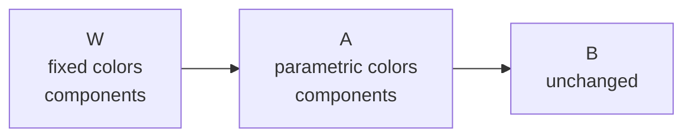

The decisive component abstraction is discovered at step 3 in the first curriculum and step 1 in the second.

> **The endpoint can be robust while the discovery path is curriculum-dependent.**

The local run reported one final representation and one final semantic state for all six curricula. A traceback after the summary was only an incorrectly indexed diagnostic assertion.

---

## 10. Revelation is state-relative

Let `I` be the current inductive state and let `Rev_I(e)` denote the representation changes revealed or forced by example `e`.

After observing `A`, the large official example `B` reveals approximately

```text
{ color parametricity }
```

while the tiny witness `W` reveals

```text
{ color parametricity,
  connected-component coupling,
  removal of the frequency assumption }
```

for this learner.

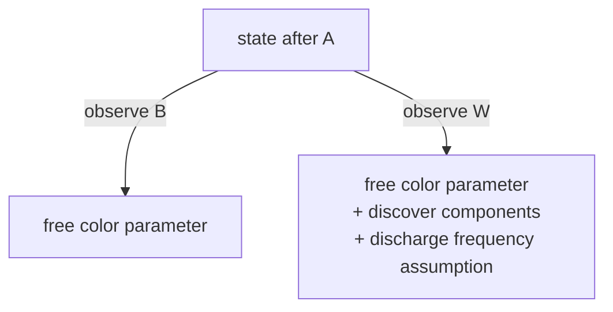

This suggests a state-relative order on examples:

$$e_1\preceq_I e_2$$

when

$$Rev_I(e_1)\subseteq Rev_I(e_2).$$

Two examples may also reveal incomparable structure. A learning event is therefore better viewed as a transition or interval in a space of inductive states than as an intrinsic scalar attached to the example.

---

## 11. Where the machinery comes from

The ingredients have useful classical antecedents:

- **Anti-unification** (Plotkin, Reynolds): least-general generalization by substitution.
- **Version spaces** (Mitchell): retain hypotheses consistent with evidence under a general-to-specific partial order.
- **Inductive Logic Programming**: subsumption and semantic generality relative to structured background knowledge.
- **Programming by example**: compactly represent large spaces of programs consistent with sparse examples.
- **Abstract interpretation**: closure operators, abstract domains, and refinement as an order-theoretic language for representation.

The goal here is not to claim novelty for these individual pieces. It is to see whether they combine into a useful account of generalization and learning dynamics, especially for ARC.

---

## 12. Connection to epiplexity

The investigation began from discomfort with defining learnable structure by training a model. The experiments suggest a separation:

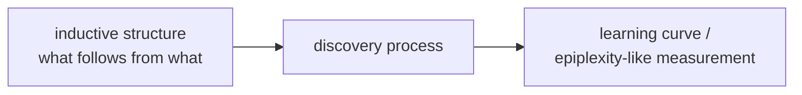

The underlying structural object may be an **inductive representation**: a preorder or consequence structure saying which explanations are instances, specializations, or consequences of others. A closure operator can give its extensional semantics.

A learning experiment probes the computational process by which an observer constructs or refines that representation:

$$I_0\to I_1\to\cdots\to I_*.$$

The ARC experiment gives a microscopic example in which all curricula reach the same `I*`, but the important abstraction is discovered at very different points.

So a candidate interpretation is:

> **Generalization describes the structural endpoint. Epiplexity-like quantities describe something about the difficulty or path of discovering that endpoint.**

This would explain why the learning experiment can be informative while still feeling unsatisfactory as the *definition* of structure. The learning curve may mix at least three things: the cost of constructing a useful representation, the evidence required to discriminate it from alternatives, and the predictive consequences once it has been found.

The structural theory attempts to factor those apart.

---

## 13. Open questions

The current account is intentionally incomplete. The most important questions are:

1. **Admissible representation operations.** Which anti-unifications, abstractions, parameter domains, and splits are available to the learner?
2. **Confluence.** Is the robust endpoint observed above typical, or do richer learners exhibit genuine path-dependent final generalizations?
3. **Real ARC coverage.** On a corpus of intended and spurious programs, how often does the intended explanation dominate by substitution or constraint weakening, and where does it remain incomparable?
4. **Representation equivalence.** When should syntactically different inductive states count as the same semantic structure?
5. **Relation to epiplexity.** Can a training-based scalar be understood as measuring computational distance through a space of inductive structures rather than defining structure itself?

The immediate empirical program is to repeat the real-task analysis across a small ARC corpus, automatically generate discriminating examples for surviving incomparable explanations, and test whether the resulting refinements remain confluent under changes of curriculum.
