# Generalization as Inductive Structure

## From ARC to a structural account of epiplexity

### Abstract

A common way to discuss generalization is to assign candidate explanations a scalar complexity and prefer the lowest-cost consistent one. Epiplexity takes a different operational route: structure is probed through a learning experiment. Both approaches leave open a more basic question: **what is the mathematical object being discovered when a learner generalizes?**

This note develops an alternative starting point. Generalization is represented by a **partial order of explanations**, generated by structural relations such as substitution, anti-unification, parameter freeing, and constraint weakening. Evidence filters explanations but need not totally order them. A fixed inductive representation induces a consequence or closure relation; learning changes that representation. This separates the **semantic endpoint of generalization** from the **dynamics and cost of discovering it**.

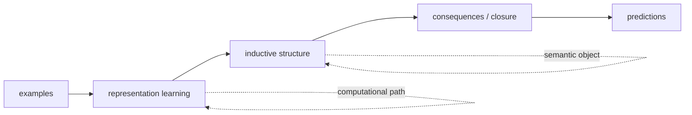

A real ARC task, `7e0986d6`, illustrates the distinction. The official training and test examples support both a connected-component explanation and a per-cell shortcut. A six-cell counterexample distinguishes them. An incremental learner presented with the same three demonstrations in all six possible orders reaches the same final inductive representation, while discovering the crucial component abstraction at different points in the sequence.

---

## 1. Generalization need not be a score

Suppose a finite set of examples admits many programs. Selecting the shortest program is one possible inductive principle, but it forces all preferences through a scalar cost. In ARC two explanations may be incomparable for a good reason, while a third may be an obvious specialization of one of them.

The starting proposal is deliberately weak:

> **Do not rank two explanations unless there is a justified structural relation between them.**

Let `H` be a hypothesis space and write

$$h_1 \preceq h_2$$

when `h2` is at least as general as `h1`. Given evidence `E`,

$$V(E)=\{h\in H \mid h\text{ agrees with }E\}.$$

The candidate generalizations are the undominated consistent hypotheses:

$$G(E)=\mathrm{Max}_{\preceq}\,V(E).$$

There need not be one element of `G(E)`.

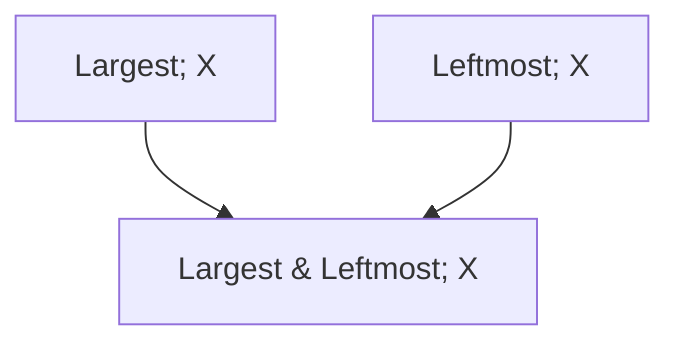

Here the conjunction is a specialization of each simpler selector, but `Largest` and `Leftmost` remain incomparable. The theory removes the gratuitous restriction without inventing a winner.

---

## 2. Generality by weakening assumptions

Write an explanation as

$$(t,\Phi)$$

where `t` is a parametric term and `Phi` constrains its parameters or applicability. For the same term,

$$(t,\Phi_1) \succeq (t,\Phi_2)$$

when

$$\Phi_2 \Rightarrow \Phi_1.$$

Generality is therefore **constraint weakening**. No number of assumptions is counted; implication supplies the order.

Examples include:

```text
Largest&Leftmost                 -> Largest
FlipX(size in {2,3,4})           -> FlipX(any size)
component-repair + frequency     -> component-repair
```

The direction is always the same: remove a restriction while preserving the explanatory body.

---

## 3. Anti-unification constructs new structure

Constraint weakening assumes that the parametric term already exists. Learning can also construct it.

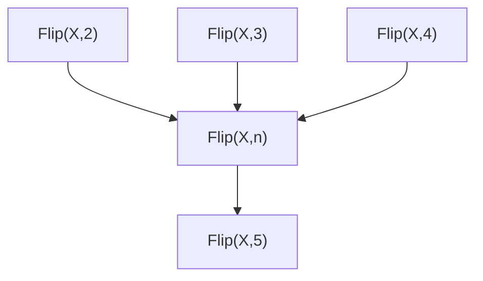

First-order anti-unification discovers the shared schema `Flip(X,n)`. Formally, the observations factor as

$$t_i=T\sigma_i.$$

Before discovering `T`, the observations can be unrelated ground facts. Afterwards they are recognized as instances of one structure.

This suggests an elementary structural learning event:

> **discover a factorization of observations into a shared schema and varying substitutions.**

Counterexamples can show that a variable was too permissive. For example,

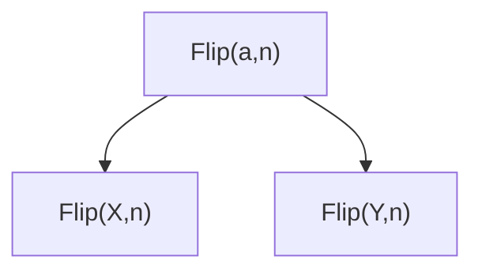

A useful size parameter survives while an over-broad action parameter is split. Representation learning therefore has two complementary operations: **merge distinctions that do not matter; split distinctions that do matter.**

---

## 4. Variables need domains and relations

Anti-unification alone does not justify arbitrary substitution. From `Flip(X,2)`, `Flip(X,3)`, and `Flip(X,4)` we can discover a size variable, but predicting size 5 requires knowing what values that variable may take.

There are importantly different sources of constraints:

1. **background typing**, such as `n : ObjectSize`;
2. **semantic constraints of primitives**, such as `FlipX` preserving dimensions;
3. **empirically induced relations**, such as `b = a + 1` inferred from `(2,3), (3,4), (4,5)`.

A learned schema is therefore naturally `(t,Phi)`, where `Phi` describes admissible substitutions. Different representations expose different constraint languages. A ground representation may express only observed pairs; an interval abstraction may overgeneralize; a relational abstraction may express `b-a=1` exactly.

This is one point of contact with abstract interpretation: the choice of abstract domain determines which relationships can be represented.

---

## 5. Closure is the semantics of a fixed inductive representation

Let `G` be a finite universe of ground instances. A representation `R` determines which instances follow from which observations. Extensionally, this can often be represented by a closure operator

$$cl_R : P(G) \to P(G).$$

For fixed `R`:

$$S\subseteq cl_R(S),$$

$$S\subseteq U \Rightarrow cl_R(S)\subseteq cl_R(U),$$

$$cl_R(cl_R(S))=cl_R(S).$$

The important correction is:

> **Closure is not learning. Closure is the consequence semantics of a fixed inductive state. Learning changes the inductive state.**

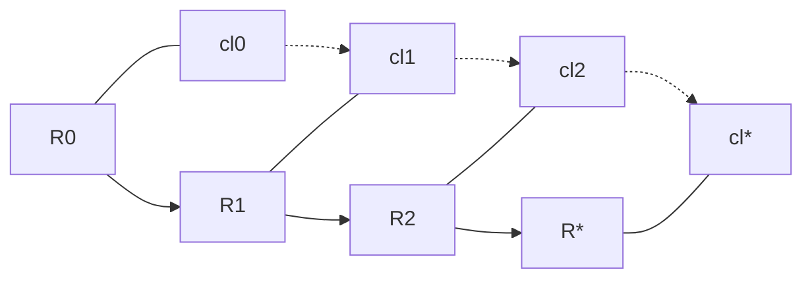

Predictions need not grow monotonically across the upper path because new evidence may change the representation itself.

---

## 6. Soundness, completeness, and refinement

For a synthetic task where the intended concept `T` is known and `E` is contained in `T`:

**Inductive soundness**

$$cl_R(E)\subseteq T.$$

**Inductive completeness**

$$T\subseteq cl_R(E).$$

**Exactness**

$$cl_R(E)=T.$$

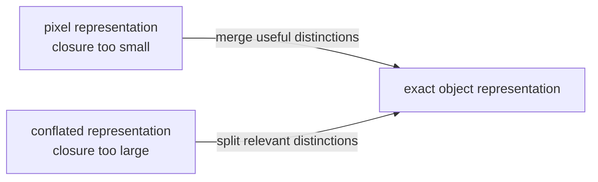

A useful refinement can therefore move in either direction. More closure is not automatically better.

---

## 7. Representation changes the generality structure

Consider the same ground behavior represented in two ways.

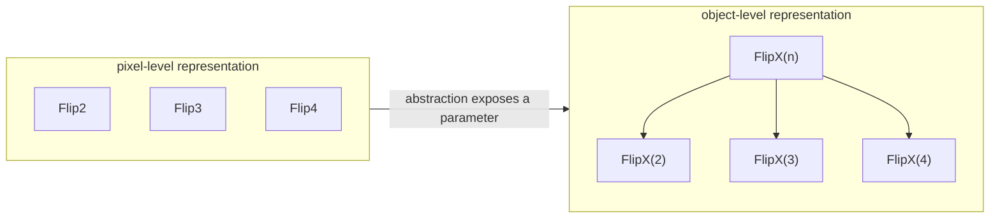

At the pixel level the operations may be unrelated atoms. At the object level they become substitution instances of `FlipX(n)`.

The observations and ground behavior have not changed. The **generality structure has changed**.

> An abstraction can help generalization by exposing substitution, subsumption, or constraint relations between concrete explanations that were absent in the lower-level representation.

This effect is logically independent of search efficiency.

---

## 8. A real ARC case: task 7e0986d6

The task contains large regions of one foreground color disturbed by small components of another color. The output removes the nuisance components, restoring nuisance cells to the nearby large component's color when they belong to it and otherwise returning them to background.

The two official training examples use different foreground colors, and the test changes them again. Fixed color identities are therefore refuted directly by the evidence.

The executable comparison produced:

| explanation | train | official test | structural status |
|---|:---:|:---:|---|
| connected-component repair | yes | yes | undominated |
| frequency shortcut | yes | yes | dominated by component repair |
| fixed first color pair | no | no | refuted by evidence |
| per-cell local shortcut | yes | yes | incomparable with component repair |

The justified edge is:

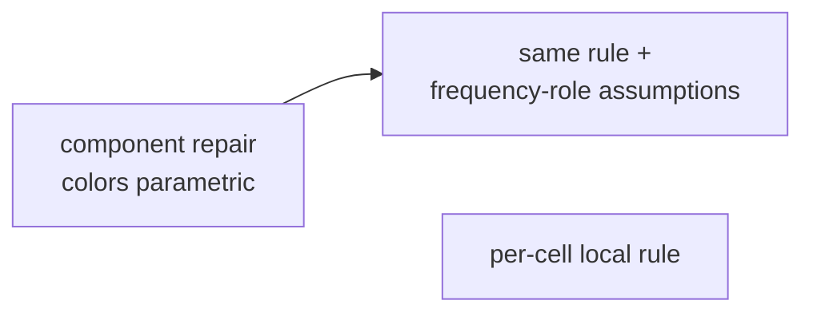

The frequency shortcut is the same component schema plus extra assumptions, so assumption weakening orders it below the structural rule. The per-cell explanation is different: both it and the component explanation fit every official training and test pair, and the current partial order correctly refuses to invent a preference.

This is a concrete case where interpolation plus the official held-out test still leaves distinct explanatory schemas unresolved.

---

## 9. The tiny puzzle that reveals the missing abstraction

An exhaustive small-grid search found a minimal meaningful witness. Blue cells below are the reference component; orange cells are one nuisance component.


The two orange cells form **one connected component**. Collectively that component is sufficiently adjacent to the blue reference component, so the structural rule repairs both cells. The per-cell rule judges them independently and erases the rightmost cell.

Adding the structural output as a demonstration preserves the component explanation and refutes the local shortcut.

> **Six foreground cells expose a structural distinction that the two much larger ARC demonstrations and the official test do not expose.**

The value of an example is therefore not well represented by its number of cells or raw data size. Its value depends on which ambiguity in the current inductive state it resolves.

---

## 10. Confluence versus curriculum

Let the two official demonstrations be `A` and `B`, and the six-cell witness be `W`. An incremental learner tracks three revisable commitments: fixed versus parametric colors; per-cell versus component structure; and an extra frequency-role assumption.

All six permutations of `A`, `B`, and `W` reached the same final representation:

```text
parametric colors
connected nuisance components
no frequency-role assumption
```

Thus, in this experiment, both strong and semantic confluence hold. But the trajectories differ:

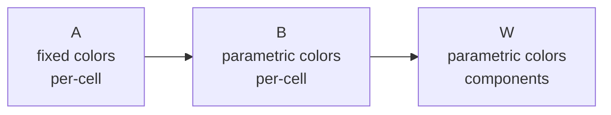

versus

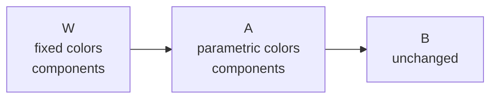

The same component abstraction is discovered at step 3 in the first curriculum and step 1 in the second.

> **The final inductive semantics can be order-independent while the discovery trajectory is strongly curriculum-dependent.**

The run printed one final representation and one final semantic state for all six curricula. A traceback after the summary came from an incorrectly indexed diagnostic assertion, not from failure of confluence.

---

## 11. Revelation is state-relative

An example does not carry a fixed amount of structural information independently of the learner's current state. Let

$$Rev_I(e)$$

denote the representation changes forced or enabled by observing `e` from inductive state `I`.

After observing `A`, the large official example `B` reveals approximately

```text
{ color parametricity }
```

whereas the tiny witness `W` reveals

```text
{ color parametricity,
  connected-component coupling,
  removal of the frequency assumption }
```

for this learner.

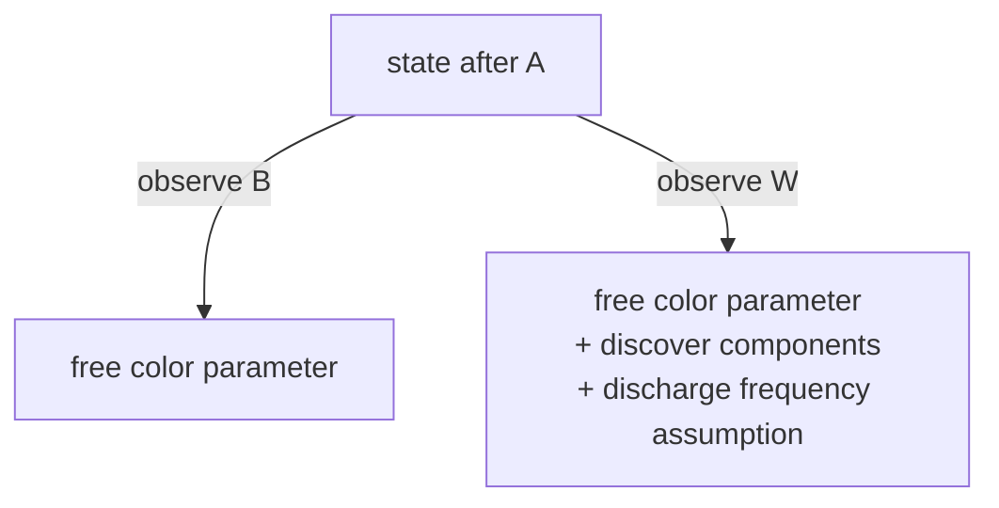

This suggests a state-relative partial order on examples:

$$e_1 \preceq_I e_2$$

when

$$Rev_I(e_1)\subseteq Rev_I(e_2).$$

No numerical information value is required. Two examples may reveal incomparable structural facts.

---

## 12. Relation to established ideas

The machinery has useful classical antecedents.

**Anti-unification.** Plotkin and Reynolds introduced least-general generalization by substitution; it constructs parametric schemas from ground explanations.

**Version spaces.** Mitchell's framework keeps hypotheses consistent with observations under a general-to-specific partial order rather than requiring a unique winner.

**Inductive Logic Programming.** Theta-subsumption and semantic generality provide mature accounts of generalization and specialization relative to structured background knowledge.

**Programming by example.** Version-space methods compactly represent many programs consistent with sparse examples; intended extrapolation remains a separate problem.

**Abstract interpretation.** Closure operators and abstract domains provide an order-theoretic language for representations and refinements. Here the orientation is inductive: which representation induces the right extrapolation from sparse evidence?

The point is not whether the individual pieces are new. The question is whether their combination gives a useful account of generalization and learning dynamics.

---

## 13. Connection to epiplexity

The investigation began from discomfort with defining learnable structure by training a model. The experiments suggest a separation.

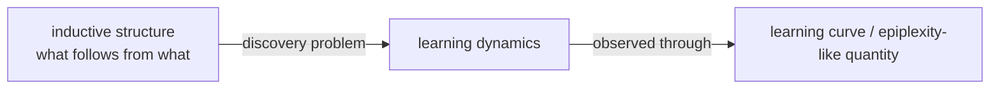

The underlying structural object may be an **inductive representation**: a preorder or consequence structure saying which explanations are instances, specializations, or consequences of others. A closure operator gives one extensional semantics for that structure.

A learning experiment probes the computational process by which an observer constructs or refines it:

$$I_0\to I_1\to\cdots\to I_*.$$

Different curricula may reach the same `I*` through very different paths. The ARC experiment gives a microscopic example: all six curricula reach the same final representation, but the decisive component abstraction is learned at step 1 in some orders and step 3 in others.

The resulting distinction is