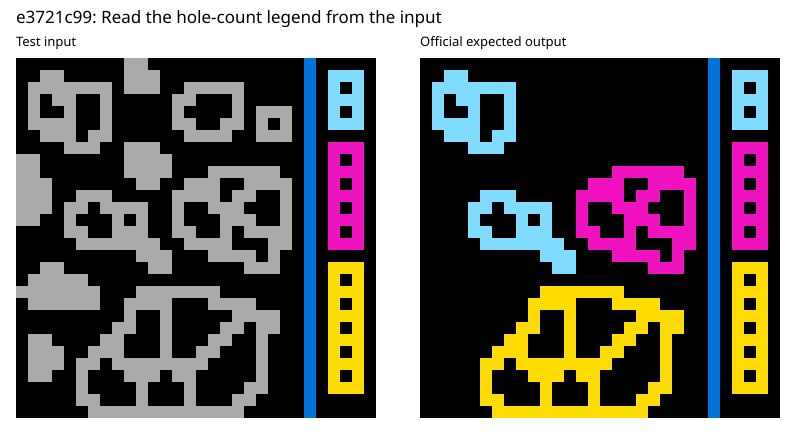
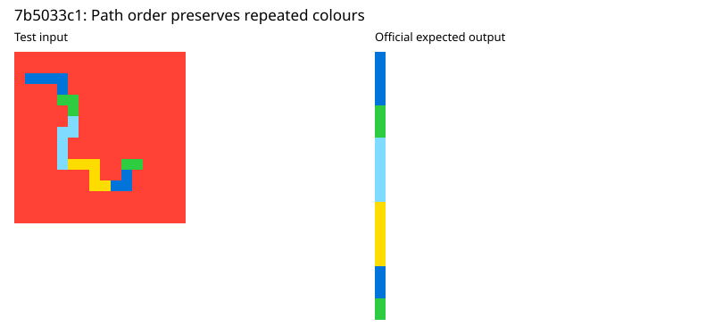

# What repairs make these ARC programs generalise?

A retrospective study of `cristianoc/arc-agi-2-abstraction-dataset`, 19 September 2026.

**What was done:** I inspected failing programs and official test answers, then hand-wrote ten repairs and executed them on the supplied examples. All ten repairs preserve the 25 training pairs and pass the 14 known test pairs, versus 0/14 for the originals. This is a retrospective repair catalogue, not an implemented method for discovering repairs.

**Pattern in these hand-written repairs:** the useful changes do more than replace constants with variables. They recover the source of a decision: a legend, a marker, a path, a global collection of objects, or a coordinate frame. Anti-unification can expose parameters, but most successful repairs additionally change how parameters are computed, what information is retained, or how the scene is represented.

## Scope and evidence

I scanned the 120 solver files and executed all 120 against the official ARC-AGI-2 evaluation tasks. I then examined twelve selected failures in detail, implementing successful repairs for ten and retaining two as partial or unresolved cases. This is a selected case study, not a complete taxonomy of all failures.

- 116/120 original solvers pass all their training examples, reproducing the repository's claim.
- 27/120 pass every supplied test example; 38/167 individual test examples pass.
- All ten selected repaired solvers preserve all 25 training pairs and pass all 14 supplied test pairs; their original versions passed 0/14 test pairs.
- The repairs also pass 390 colour-permutation checks and 13 reflection/transposition checks. I manually chose task-specific transformations and fixed colours after inspecting the tasks and answers. These assumptions were neither inferred from training data nor established as universal ARC invariants. The transformed cases check consistency with those assumptions; they are not independently drawn ARC examples.
- **Test outputs were inspected during diagnosis and repair. These results establish retrospective repairs, not blind discovery or a generalisation benchmark score.** No claim is made that the repairs are unique or correct on every future instance.
- The prototypes are ordinary Python. I have not certified them against CompDSL's syntax or complexity validators. Several reuse the original solver's helpers.

Source snapshot: [solvers, commit ddf6a3e](https://github.com/cristianoc/arc-agi-2-abstraction-dataset/tree/ddf6a3e7e2db6e0e0cf24dc99368e8386e78e63c). Data: [ARC-AGI-2, commit f3283f7](https://github.com/arcprize/ARC-AGI-2/tree/f3283f727488ad98fe575ea6a5ac981e4a188e49/data/evaluation). Exact source blob hashes are recorded in the experiment archive.

## Verified repairs

All counts below are exact whole-grid matches, not cell accuracy. Every listed original solver passes its training examples and fails all its test examples.

| Task | Original mechanism | Repair | Principled interpretation | Repaired train / test |
|---|---|---|---|---|
| `1ae2feb7` | Treat colour 2 as the barrier; extrapolate right | Detect the long vertical barrier, infer the populated side, reflect if necessary | Role abstraction and reflection equivariance; parameterisation is only part of it | 3/3; 3/3 |
| `135a2760` | Repair rows using their currently visible non-background extent | Orient by the enclosing frames; repair their complete interiors | Coordinate normalisation plus recovery of the proper domain | 2/2; 1/1 |
| `221dfab4` | Fixed vertical stripe, phase anchored at row zero | Orient from the yellow marker and measure periodic phase from it | Relative coordinates, translation/orientation equivariance | 2/2; 2/2 |
| `dbff022c` | Fixed enclosing-colour → fill-colour cases | Read a directed colour-pair legend from the current input | Parameter abstraction plus relational interpretation of input data | 3/3; 1/1 |
| `e3721c99` | Hard-coded hole-count, area and size classifier | Read the hole-count → colour legend; use 8-connected target objects | Topological invariant and input-dependent classification; representation repair | 2/2; 2/2 |
| `8f215267` | Lookup a local patch beside each frame | Count all small objects of the frame's colour across the instruction area | Correct aggregation scope; permutation-invariant counting | 3/3; 1/1 |
| `97d7923e` | Position- and length-specific fill guards | For each colour, fill the kth tallest bar; k is the marker length | Relational ordering and an order statistic | 3/3; 1/1 |
| `7b5033c1` | Histogram ordered by first occurrence | Traverse the coloured path from its upper endpoint | Representation refinement: preserve adjacency and sequence | 2/2; 1/1 |
| `a251c730` | Memorised outputs selected by colour histogram | Extract multicolour templates from one frame and stamp at matching anchors in the other | Object-centred coordinates, correspondence, reusable templates | 2/2; 1/1 |
| `6ffbe589` | Dispatch on exact colour sets and crop dense runs | Read external colour markers as quarter-turn counts; rotate colour layers independently | A small instruction interpreter and a cyclic group action | 3/3; 1/1 |

Each task's original code is at `tasks/<id>/solution.py` in the linked solver snapshot; its examples are `<id>.json` in the linked data snapshot.

## 1. From constants to roles: 1ae2feb7

[Original solver](https://github.com/cristianoc/arc-agi-2-abstraction-dataset/blob/ddf6a3e7e2db6e0e0cf24dc99368e8386e78e63c/tasks/1ae2feb7/solution.py).

All training barriers are red (2). Test barriers are yellow or green, and one test places the source segments on the opposite side. One barrier also stops before the final blank row. The repair identifies the column with the longest contiguous nonzero monochromatic run, uses it as the separator, and normalises the source side before reusing the segment-period mechanism.

A template such as `repeatBeyondBarrier(grid, barrier, direction)` expresses the right parameterisation. Anti-unification of suitably aligned specialised programs could produce that template. It would not, by itself, infer either the barrier detector or the source-side rule.

This example also shows why indiscriminately abstracting numeric constants is inappropriate: colour 2 is incidental here, but segment lengths determine the periods and must retain their relation to the input.

## 2. Normalise coordinates, then recover the intended extent: 135a2760 and 221dfab4

In `135a2760`, training patterns run horizontally and the test patterns vertically. Transposing according to frame orientation fixes almost everything, but leaves **two cells wrong**. The original method identifies the repair interval using the first and last surviving pattern pixels. Missing pixels at an endpoint are therefore excluded from repair. Using the enclosing frame to define the complete interval fixes both remaining cells.

This is a compound repair: symmetry normalisation is necessary but insufficient. The region being repaired must be defined independently of the damage it is meant to correct. The prototype retains the original period search bound of six; success here is not a justification for that bound on arbitrary future tasks.

In `221dfab4`, the original periodic rule uses `r % 6`. Training happens to align its green rows at row zero. The repaired rule measures distance from the yellow seed stripe: offsets 0 and 2 modulo 6 are yellow, offset 4 is green, and the intervening stripe cells use the background colour. A transpose handles a seed stripe at the left edge. The original object overlay can then be retained in the normalised coordinates.

The principled operation is change of coordinates. If $T$ puts an input into a canonical orientation, use

$$
T^{-1}\!\bigl(P(T(x))\bigr).
$$

The hard part includes selecting T from structural evidence. Equivariance is a requirement on the resulting function, not a theorem that automatically identifies T.

## 3. The input contains a local rulebook: dbff022c and e3721c99



For `dbff022c`, the earlier anti-unification example was real but incomplete:

```python
if 5 in adjacency: return 5
if 6 in adjacency: return 6
# shared template: if n in adjacency: return n
```

The actual repair is stronger. A small multicolour rectangular legend lists **directed pairs**. Read each pair from the outside boundary toward the interior of the scene, then fill enclosed zero cavities according to that mapping. The legend moves from the top/left in training to the bottom in the test.

An initial bidirectional interpretation failed: exchanging the two colours is not valid. Reading the legend in a fixed top-to-bottom direction also misses the bottom legend. Both direction and the source of the mapping matter. The existing cavity detector can otherwise be reused.

For `e3721c99`, coloured legend objects encode a mapping from number of holes to output colour. Grey objects should receive the matching colour; unmatched hole counts are erased. Two changes are needed: interpret the current legend rather than retain a fixed table, and use **8-connected grey objects with 4-connected background holes**. Merely changing classifier constants retains the wrong object decomposition for diagonally joined shapes.

The hole count is a genuine topological feature of the chosen digital representation. The connectivity convention is part of that representation and cannot be silently omitted.

These repairs have the form:

```text
rule = readLegend(input)
for object in objects(input):
    apply(rule, object)
```

Anti-unification may expose the rule as a parameter. Reading a relation encoded in the input is an additional synthesis problem. Calling this an interpreter or input-dependent relational inference describes the implemented mechanism; it does not establish a new general learning algorithm.

## 4. Repair the scope of the computation: 8f215267

[Original solver](https://github.com/cristianoc/arc-agi-2-abstraction-dataset/blob/ddf6a3e7e2db6e0e0cf24dc99368e8386e78e63c/tasks/8f215267/solution.py).

The solver stores a table from a patch immediately to a frame's right to its output count. That local patch is the wrong scope. The count is the number of small connected objects of the frame's colour **throughout the instruction area**, including objects above or below the frame.

For the test, the global counts are red 2, yellow 4, green 1, blue 1. Substituting those counts into the existing renderer produces the exact answer.

This is not simply a more flexible patch matcher. It changes the dependency from a local neighbourhood to a global collection. The resulting count is invariant under rearrangement of those objects, provided they remain separately detected in the instruction region. A synthesis system needs a way to reconsider the scope over which it aggregates.

## 5. Replace accidental position with a relation: 97d7923e

[Original solver](https://github.com/cristianoc/arc-agi-2-abstraction-dataset/blob/ddf6a3e7e2db6e0e0cf24dc99368e8386e78e63c/tasks/97d7923e/solution.py).

The original guards include `top.start == 3 and middle.length >= 5` and a condition near the right edge. The repaired rule groups capped bars by cap colour, sorts them by height, and fills the kth tallest bar. A short marker of that colour at the top supplies k.

In the test, the ranks are blue 2, red 1, green 3, yellow 1. The repair selects those bars exactly. This is relational abstraction: rank among peers replaces absolute position and thresholds.

Anti-unifying the original guards would leave predicate holes. It would not imply sorting, grouping, or rank selection. Those are additional program structures. Tied heights and out-of-range markers are not resolved by these supplied examples; the prototype is not evidence of a general tie rule.

## 6. A representation can throw away the answer: 7b5033c1



[Original solver](https://github.com/cristianoc/arc-agi-2-abstraction-dataset/blob/ddf6a3e7e2db6e0e0cf24dc99368e8386e78e63c/tasks/7b5033c1/solution.py).

The original solver counts each colour and emits one run per colour, ordered by its first raster occurrence. Training paths happen to have one contiguous path segment per colour. In the test, blue and green recur after intervening colours. A single histogram bucket cannot encode their separated occurrences.

The repair constructs the 4-neighbour path, starts from its upper endpoint, and emits the colour of each visited cell. It succeeds on all three examples.

There is a stronger conclusion than “a parameter was wrong”: **the existing output representation cannot express the required answer**. Any change that retains exactly one output run per colour will fail this test. The repair must preserve sequence information, for example by introducing graph traversal. Endpoint selection remains a hypothesis supported by these examples, not a universally established path orientation rule.

## 7. Learn a template from this input: a251c730

[Original solver](https://github.com/cristianoc/arc-agi-2-abstraction-dataset/blob/ddf6a3e7e2db6e0e0cf24dc99368e8386e78e63c/tasks/a251c730/solution.py).

The original implementation maps colour-frequency signatures to entire memorised output grids. The repair finds the two framed panels. One contains multicolour source objects, each with a uniquely occurring marker colour. The other contains singleton markers. Represent each source object by offsets from its marker, and stamp it at matching target markers while preserving the target panel's border and background.

This replaces dataset-level memorisation with an input-local library of templates. Translation to marker-relative coordinates explains reuse. The repaired test also preserves a red border, whereas the original fallback forces a green border.

This connects to correspondence and template abstraction. It is not the direct result of anti-unifying raw memorised output grids: the frames, objects and anchors first have to be discovered.

## 8. Recover an interpreter: 6ffbe589

[Original solver](https://github.com/cristianoc/arc-agi-2-abstraction-dataset/blob/ddf6a3e7e2db6e0e0cf24dc99368e8386e78e63c/tasks/6ffbe589/solution.py).

The original program dispatches on exact palettes. The successful repair interprets the number of external marker cells of each colour as a number of clockwise quarter-turns, modulo four, for that colour's layer of the main figure. A colour with no external marker stays fixed.

The test's grey layer gets three turns, green two, and yellow one. The main figure must also be extracted without dropping its disconnected outer pieces: the original dense-run crop produces 7×7 rather than 13×13. The prototype groups nonzero cells within Chebyshev distance two and selects the largest group before cropping. This extraction heuristic works on the supplied examples, but is not a universal object-separation theorem.

The semantic core is principled: each instruction denotes an element of the cyclic rotation group $C_4$. The geometric extraction remains a separate assumption. This is a useful example of a principled core combined with a contingent perception routine.

## Partial and unresolved repairs

### 0934a4d8: symmetry helps, but does not determine all missing cells

[Original solver](https://github.com/cristianoc/arc-agi-2-abstraction-dataset/blob/ddf6a3e7e2db6e0e0cf24dc99368e8386e78e63c/tasks/0934a4d8/solution.py).

The original solver chooses one reflected source block using distance and a hard-coded offset. A replacement searches reflection axes that agree on every pair of observed non-mask cells, then propagates known values through the horizontal/vertical reflection orbits.

This reproduces all four training answers. On the test, it recovers **19/27 cells correctly**. The other eight cells have no observed member in their in-grid reflection orbit: a reflection goes outside the cropped grid, or lands in the masked region. The prototype rejects rather than invents their values.

This is a concrete limit of the proposed repair. The symmetry constraints used here do not determine those eight cells. Extra structure—perhaps larger-scale motif matching or another relation—must be established before completing the answer. I have not verified that next repair. This does not prove the task itself is ambiguous; it shows that these particular constraints are insufficient.

### 5dbc8537: likely geometric assembly, no verified repair

[Original solver](https://github.com/cristianoc/arc-agi-2-abstraction-dataset/blob/ddf6a3e7e2db6e0e0cf24dc99368e8386e78e63c/tasks/5dbc8537/solution.py).

The existing horizontal and vertical solvers paint palettes memorised from the training outputs. Inspecting the grids suggests that the intended operation assembles source pieces into the target silhouette, preserving their multicolour detail. This is a diagnosis and proposed repair direction, not an implemented solution.

A candidate formulation introduces a placement variable for each source piece and requires compatible coverage of the target mask without overlap. Exact cover or a constraint-satisfaction formulation could be appropriate once the pieces, allowed transformations, and treatment of small black cells are specified. Those choices remain unresolved here. Naming “constraint solving” does not solve their discovery.

Anti-unification can factor the horizontal/vertical painting machinery after coordinate normalisation. It cannot by itself replace the memorised palette with a solution to the assembly problem. I do not classify this task as repaired.

## What the patterns say about anti-unification and MDL

The standard anti-unification guarantee concerns common substitution instances: from specialised fragments $P_i$, obtain a template $G$ and substitutions $\sigma_i$ such that

$$
G\sigma_i = P_i \qquad \text{for every } i.
$$

It does not guarantee that executing a repaired, closed solver gives more correct answers. See [Cerna and Kutsia, Anti-unification and Generalization: A Survey](https://www.ijcai.org/proceedings/2023/0736.pdf).

The repairs suggest a useful hierarchy:

1. **Expose a parameter.** Replace a particular colour, direction, palette, or predicate with an unknown. Anti-unification can justify this when aligned program fragments are available.
2. **Bind it from the input.** Detect the barrier, read the legend, decode the marker, or extract a source template. Anti-unification alone does not supply this binding.
3. **Change a relation or scope.** Replace absolute position with rank; replace a local patch with global counting.
4. **Change the representation or algorithm.** Preserve a path instead of a histogram; use a different connectivity; introduce object placement.
5. **Acknowledge residual uncertainty.** A principled constraint system can still leave cells or arrangements undetermined.

These are mechanisms, not mutually exclusive task labels. A single successful repair often combines several. No verified case here demonstrates that raw AST anti-unification alone recovers a full successful solver.

For symmetry, a proposed contract uses corresponding input and output transformations:

$$
P\bigl(T_{\mathrm{in}}(x)\bigr)
= T_{\mathrm{out}}\bigl(P(x)\bigr).
$$

This removes dependence on incidental coordinates or colour names when that transformation really is a task symmetry. It is not valid to assume every colour permutation or geometric transformation is a symmetry of every ARC task. The general mathematical connection is equivariance; see [Bronstein et al., Geometric Deep Learning](https://arxiv.org/abs/2104.13478).

MDL could rank descriptions of these mechanisms. A legend interpreter can replace many colour cases; a path traversal can replace a histogram plus exceptions; a template interpreter can replace entire stored outputs. But the relevant operations must be expressible in the hypothesis language. A shorter encoding does not prove that the hypothesis is intended, and no MDL objective was implemented or measured in this study. Library learning is relevant to making such reusable operations available; [DreamCoder](https://arxiv.org/abs/2006.08381) is a precedent, not an explanation that subsumes every repair here.

## A concrete next experiment

Use these repairs as a catalogue of candidate transformations, then test discovery separately. Freeze a repair grammar and its selection criterion. Give the system only training pairs and the original program; withhold official test outputs. Ask it to identify unsupported commitments, propose replacements, and retain alternatives when the evidence does not distinguish them.

Useful checks include leave-one-training-pair-out reconstruction and justified metamorphic transformations. These can expose fragile assumptions but cannot certify the intended unseen answer. The key research target is whether the system can discover the input dependency or representation change, rather than merely edit a failing test case after seeing its answer.

## Reproduction and limitations

See [the experiment protocol](README.md) for commands. Executable witnesses load pinned external solvers and task data through a verified cache; they do not copy or modify SymArc. Retained [baseline results](../evidence/006-repair-audit/baseline.json) and [repair results](../evidence/006-repair-audit/repair_results.json) support the counts above.

The original retrospective runs preceded registration. Their wall time and toolchain were not recorded systematically; no timing comparison is claimed. The new reproduction manifest records the environment and hashes for the repeat check.

Colour checks use ten seeded random permutations per example. Background 0 is held fixed; target colour 5 is also fixed for e3721c99, and designated colours 3 and 4 for 221dfab4. Geometry checks cover reflection for 1ae2feb7 and transposition for 135a2760 and 221dfab4. All 403 checks pass. These are limited contracts, not general robustness.

The partial symmetry witness is deliberately outside the successful-repair registry. It rejects unresolved cells. The next experiment must distinguish an expressive witness from an algorithm that discovers it without test labels.
