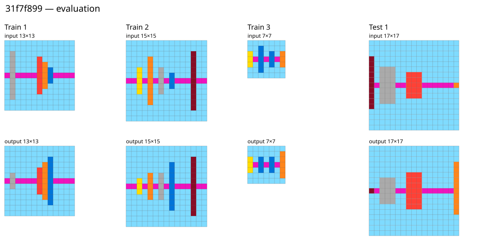
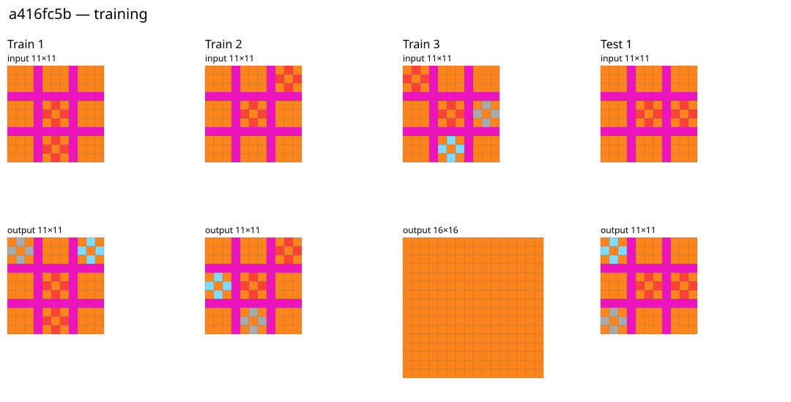

# 010: do intended test outputs break symmetry patterns suggested by training?

**Implemented and run on all 1,120 public ARC-AGI-2 tasks**, not just the earlier
repair examples: 1,000 corpus-training tasks and 120 corpus-evaluation tasks,
containing 3,591 demonstration pairs and 1,243 test pairs. Private tasks are not
available. The previous 009 audit covered the 120 public evaluation tasks.
The official corpus revision is `f3283f727488ad98fe575ea6a5ac981e4a188e49`.

The same finite menu was used everywhere: seven whole-grid rotations/reflections
and, for the equivariance check, 45 individual colour swaps. No task-specific
fixed colours or manually selected symmetries. Training pairs select patterns;
intended test outputs are then inspected for violations. This is a descriptive
public-data audit, not a blind solver benchmark.

**Main result:** 14 tasks have a symmetry in every training output that is absent
from a test output. However, in every flagged query, the test input also lacks
that symmetry. **No task meets the stronger test:** at least two informative
training examples preserve an input symmetry, but a symmetric test input receives
an asymmetric output. Thus this audit finds training-pattern exceptions, but no
strong preservation counterexample under this particular menu and support rule.

| Corpus split | Tasks | Output-pattern exceptions | Stronger preservation exceptions | Newly incompatible equivariance laws: affected tasks |
|---|---:|---:|---:|---:|
| Training | 1,000 | 10 | 0 | 24 |
| Evaluation | 120 | 4 | 0 | 2 |

These task counts overlap across columns. The 14 output-pattern tasks yield 21
transformation/query flags. All their training outputs contain multiple colours;
the flags are not explained by entirely monochrome training outputs.
[Direct report](report.md), [all flags CSV](flags.csv), [complete results](results.json),
[protocol](protocol.md), and [manifest](run.json) are retained.

## What counts as a “surprise” here?

An output-only pattern says that every observed output is fixed by a particular
spatial transformation. Its failure on the test is an empirical exception:

```math
\forall i,\ T(y_i)=y_i,\qquad T(y_*)\ne y_*.
```

But this can be explained by a feature of the new input. A stronger warning would
be preservation learned from repeated symmetric inputs, followed by a break on
another symmetric input:

```math
T(x_i)=x_i\ \Longrightarrow\ T(y_i)=y_i,\qquad
T(x_*)=x_*,\quad T(y_*)\ne y_*.
```

The first implication must have at least two observed, nondegenerate input
instances and no counterexample in training. A transformation that is literally
the identity on a grid's coordinates does not count as supporting evidence—for
example, flipping a one-row grid top to bottom. Output-only checks likewise
exclude such degenerate actions. No stronger warning was found, even when only
a subset of the training inputs supplied the required two instances.

Neither definition is a calibrated probability of surprise. Multiple patterns
are tested per task, and coincidence remains possible with two or three examples.
A flagged pattern is a lead for explanation, not a proof that the task was set up
incorrectly. Conversely, no flag certifies a task as well-posed. These checks cover
whole-grid centred spatial actions, not object-local or off-centre symmetries,
translations, relational role swaps, topology or arbitrary abstractions.

## All 14 output-pattern tasks

| Split | Task | Training pairs | Broken symmetry or symmetries |
|---|---|---:|---|
| Evaluation | `31f7f899` | 3 | Top–bottom reflection |
| Evaluation | `3a25b0d8` | 2 | Left–right reflection |
| Evaluation | `4e34c42c` | 2 | Top–bottom reflection |
| Evaluation | `67e490f4` | 2 | Quarter-turns and both diagonal reflections |
| Training | `21f83797` | 2 | Top–bottom reflection |
| Training | `2ccd9fef` | 2 | Top–bottom reflection |
| Training | `351d6448` | 2 | Top–bottom reflection |
| Training | `39a8645d` | 3 | Top–bottom reflection |
| Training | `3d6c6e23` | 3 | Left–right reflection |
| Training | `42f14c03` | 3 | Top–bottom reflection |
| Training | `4522001f` | 2 | Main-diagonal reflection |
| Training | `8719f442` | 3 | Main-diagonal reflection |
| Training | `99306f82` | 3 | Main-diagonal reflection |
| Training | `caa06a1f` | 3 | Half-turn and both diagonal reflections |

In each flagged query the input is also asymmetric under the flagged action.
This is a factual qualification, not a blanket explanation of every task's rule.
The four evaluation cases were visually inspected after the scan:

- **`31f7f899`: a one-cell input asymmetry accompanies a one-cell output
  asymmetry.** All three training inputs and outputs have top–bottom symmetry.
  In the test input, the sole mismatched reflected pair is at zero-based rows
  3/13, column 0; in the output it is at rows 3/13, column 16. A bar-length
  asymmetry is transferred to the opposite side. Output symmetry alone would
  incorrectly demand a symmetric answer. This is an explainable pattern break,
  not evidence of a defect.
- **`3a25b0d8`:** the two training outputs are left–right symmetric patterned
  objects, whereas the test scenes contain asymmetric patterned objects and
  the outputs retain asymmetry. The extra input structure is visible. This
  observation does not by itself reconstruct the full transformation rule.
- **`4e34c42c`:** training outputs arrange components in a horizontal strip;
  test outputs have branching, two-dimensional arrangements. The training
  strip's top–bottom symmetry does not persist. Again the test inputs differ
  visibly in arrangement; no task defect is established by this flag.
- **`67e490f4`:** training outputs are square (11×11 and 13×13), but the test
  output is 7×30, matching a rectangular template visible in the test input.
  Quarter-turn and diagonal symmetries must fail on that non-square output.
  This is a change of demonstrated shape regime, not unexplained symmetry loss.



Further boards: [3a25b0d8](figures/3a25b0d8.svg),
[4e34c42c](figures/4e34c42c.svg), [67e490f4](figures/67e490f4.svg).
These case readings are post-run descriptive inspection, not additional
preregistered measurements. No claim is made that every weak flag is resolved.

## Why 26 tasks acquire an equivariance contradiction

The third check asks only whether each individual cyclic transformation law can
fit the labelled examples. It finds **35 newly contradicted task/law combinations
in 26 tasks**: 14 spatial laws and 21 colour swaps. This is different from an
observed training pattern breaking. None of these laws had a training transport
between distinct, changed inputs to support it. Most merely faced no applicable
symmetry constraint on the original training inputs. The two colour-law cases
with training self-transports involve absent colours and remain weak evidence.

Two examples illustrate why compatibility should not be called a learned law:

- **`dc433765`:** swapping green and yellow maps training input 7 to test input
  1, but their outputs are not related by that colour swap. Nevertheless all
  seven training examples show green moving one step toward yellow while
  yellow stays fixed; both tests follow the same rule. The colours already have
  distinct roles in training. The colour-swap law was merely untested by an
  exact input transport; it was not a reasonable summary of the demonstrated
  transformation. This interpretation was checked on all nine supplied pairs.
- **`1c56ad9f` and `50c07299`:** the test input introduces a whole-grid symmetry
  absent from the training inputs. Their outputs break that symmetry. Training
  already shows spatially oriented changes, so full orientation neutrality was
  an additional assumption, not something these checks learned.

See [dc433765](figures/dc433765.svg), [1c56ad9f](figures/1c56ad9f.svg),
and [50c07299](figures/50c07299.svg). The exact transport witnesses are in the
results. Unlike 009's aggregate groups, checking each generator separately can
expose a new contradiction even when some other symmetry was already refuted
in training. The two audits therefore answer different questions.

## A separate data-quality review lead: a416fc5b

Inspection of another newly contradicted law exposed an anomaly in the supplied
training data: all three training inputs are patterned 11×11 grids; two outputs
and the test output are patterned 11×11 grids, but the third training output is
an entirely orange 16×16 grid. This is worth reviewing with the task author.
A subsequent source check found [upstream PR #18](https://github.com/arcprize/ARC-AGI-2/pull/18), opened in March 2025, reporting this same blank output and a missing input, with a proposed correction. The PR remains open and the pinned dataset is unchanged. This is therefore an existing reported annotation problem, not a newly discovered defect; the audit itself did not verify the proposed replacement. It is not evidence
that the test output itself is wrong, and it was not the preregistered target.



## Validation, scope and reproduction

Five controls passed before the corpus run. An independent NumPy implementation
recomputed all spatial flags and the zero-preservation result; all 1,120 task
hashes and original result hashes were verified. See [verification](verification.json).
Code and protocol were published at
`a0a0523982640bd8e9b25c7de0e88370ed80d74b` before measurement. All 1,120 inputs have
recorded hashes. Twelve workers completed the functional run in 2.21s; this is
not a performance comparison. No thresholds or law families were tuned after
results. The preregistered top-six preservation inspection list is empty because
there were no qualifying cases; the weaker-case inspection above is explicitly
post-run follow-up.

Closed diagnostic; no stable solver or accepted-math change. Runnable source
remains at `a0a0523`; the completed runner is removed from the live tree. To
reproduce from that revision, clone the official ARC-AGI-2 repository at the
pinned revision, then run from the arc-challenge root:

```sh
python3 symarc/experiments/010-test-surprises/run.py --test
timeout 600 python3 symarc/experiments/010-test-surprises/run.py \
  /absolute/path/to/ARC-AGI-2 symarc/out/experiments/010-test-surprises
```

This study does address training patterns broken by intended tests across the
whole public corpus. Its conclusion is limited: the tested output patterns
sometimes break, but the stronger repeated-preservation criterion provides no
confirmed surprise of that form. Broader claims about task quality need richer
candidate laws, justified input conditions, and inspection of the intended rule.
